# 業務フロー

本ドキュメントは、無人セットアップ応答ファイル生成ツール（`unattend-generator_ja-JP`）における主要なユースケースごとの業務・システムフローを定義したものです。

---

## 1. キーボード・地域設定フロー
日本語環境（ja-JP）における106/109日本語キーボードの自動適用およびレジストリ書き換えによる永続化フロー。

**参加者:**
- インフラ管理者 (actor)
- 応答ファイルジェネレーター(UI) (system)
- Windowsセットアップ(WinPEフェーズ) (system)
- Windowsセットアップ(Specializeフェーズ) (system)

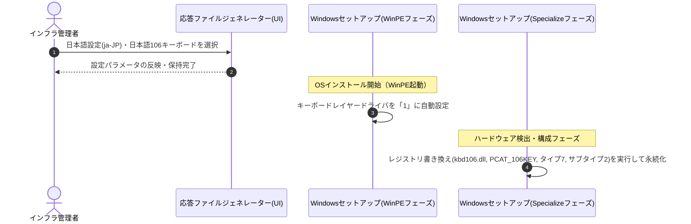

---

## 2. システム最適化フロー（ブロートウェア削除）
不要なプリインストールアプリ（Teams、OneDrive、Xbox関連等）を指定し、無人セットアップ中に自動でアンインストールするフロー。

**参加者:**
- インフラ管理者 (actor)
- 応答ファイルジェネレーター(UI) (system)
- Windowsセットアップ(FirstLogonフェーズ) (system)

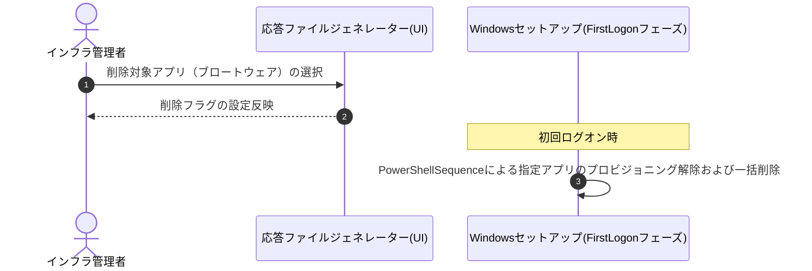

---

## 3. アカウント・セキュリティポリシー設定フロー
ローカルアカウントに対するパスワードポリシーおよびアカウントロックアウトの適用フロー。

**参加者:**
- インフラ管理者 (actor)
- 応答ファイルジェネレーター(UI) (system)
- Windowsセットアップ(Specialize/FirstLogon) (system)

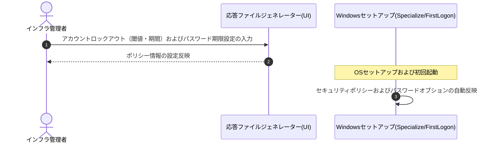

---

## 4. ストレージ構成・パーティショニングフロー
対象ディスクの特定および MBR/GPT パーティション構成の自動構成フロー。

**参加者:**
- インフラ管理者 (actor)
- 応答ファイルジェネレーター(UI) (system)
- Windowsセットアップ(WinPEフェーズ) (system)

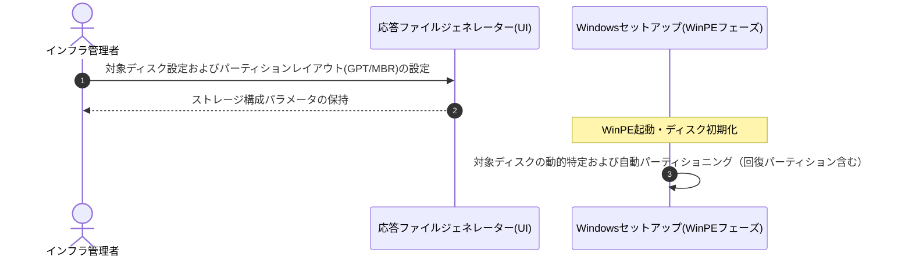

---

## 5. UI・操作環境最適化フロー
クラシックコンテキストメニュー有効化や拡張子常時表示など、デスクトップ環境の自動カスタマイズフロー。

**参加者:**
- インフラ管理者 (actor)
- 応答ファイルジェネレーター(UI) (system)
- Windowsセットアップ(FirstLogonフェーズ) (system)

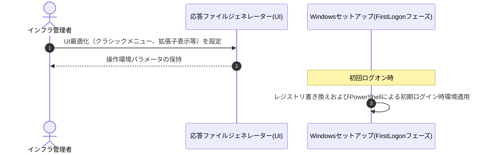

---

## 6. ファイル生成・出力フロー
ブラウザ内 GenerationContext による応答ファイル（`autounattend.xml`）の即時構成と ISO パッケージの生成・ダウンロードフロー。

**参加者:**
- インフラ管理者 (actor)
- 応答ファイルジェネレーター(UI) (system)
- GenerationContext(ブラウザ) (system)
- ISO 9660 Builder (system)

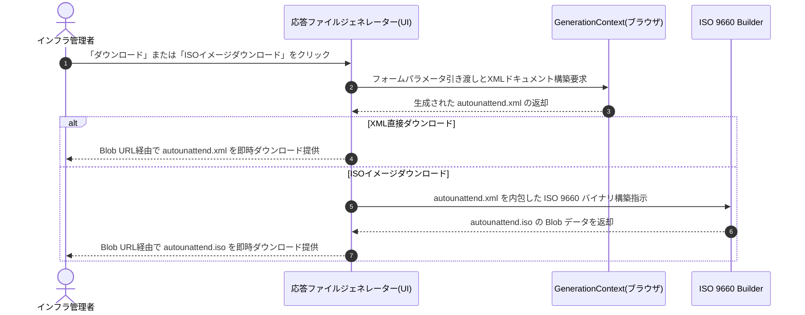

---

## 7. 設定管理・インポートフロー
過去に作成した応答ファイルを読み込み、UIフォームへ瞬時に設定値を復元するインポートフロー。

**参加者:**
- インフラ管理者 (actor)
- 応答ファイルジェネレーター(UI) (system)
- FormBridge (JavaScript) (system)

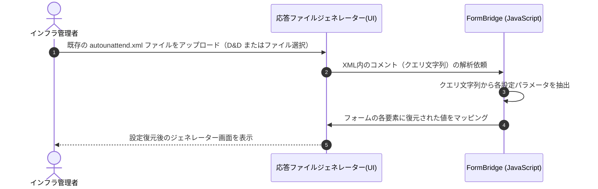

---

## 8. セキュリティ保護・機密ファイル消去フロー
自動セットアップ完了時、媒体に残る平文パスワードなどの機密ファイル（`unattend.xml` 等）を強制削除する保護フロー。

**参加者:**
- Windowsセットアップ(FirstLogon完了フェーズ) (system)
- システムローカルディスク (database)

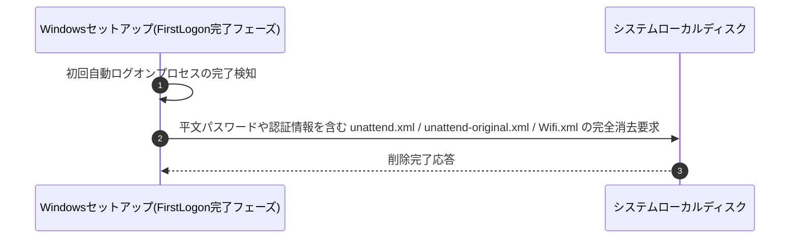

---

## 9. ネットワーク設定フロー
セットアップ段階でのWi-Fi通信自動構成と、ネットワークサービス（WlanSvc）起動待機・接続検証フロー。

**参加者:**
- インフラ管理者 (actor)
- 応答ファイルジェネレーター(UI) (system)
- Windowsセットアップ(Specializeフェーズ) (system)

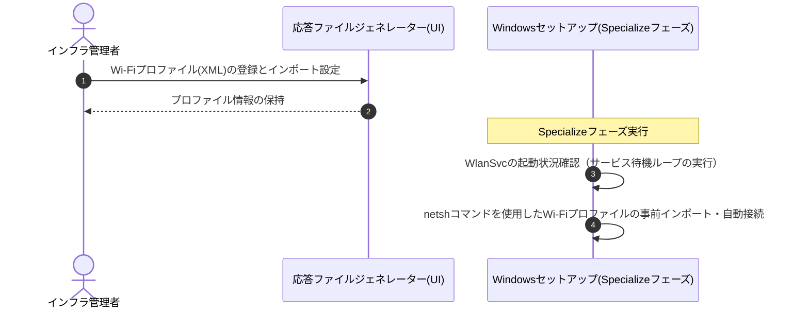

---

## 10. セットアッププロセス制御フロー
Windows OOBE初回起動時における簡易設定（ExpressSettingsMode）の一括無効化（オプトアウト）および制御フロー。

**参加者:**
- インフラ管理者 (actor)
- 応答ファイルジェネレーター(UI) (system)
- Windowsセットアップ(OOBEフェーズ) (system)

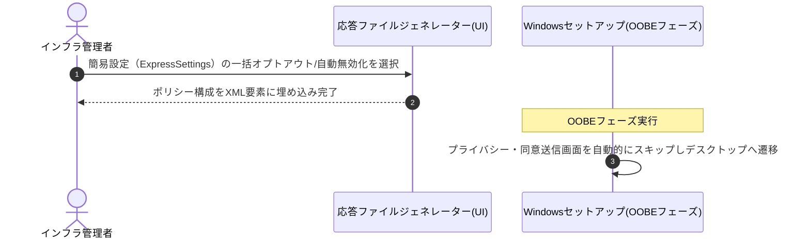

---

## 11. バリデーション・統制フロー
応答ファイル生成前に入力パラメータの不整合（管理者有無、コンピュータ名制限等）を自動判定する検証フロー。

**参加者:**
- インフラ管理者 (actor)
- 応答ファイルジェネレーター(UI) (system)
- 整合性検証ロジック(Validation) (system)

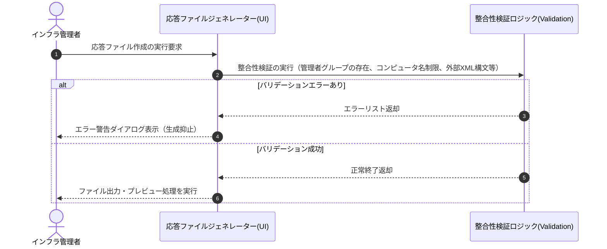

