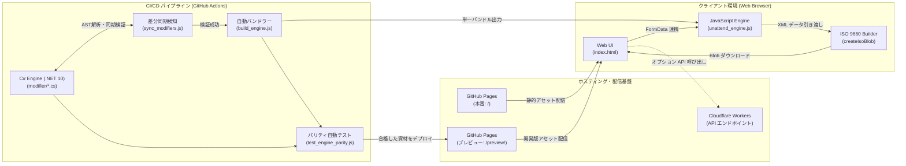

# システム概要

本ドキュメントは、Windows 無人セットアップ応答ファイル生成システム（`unattend-generator_ja-JP`）のシステム構成、技術スタック、システム間連携、データフロー、セキュリティ方針、およびインフラ構成を定義したものです。

---

## 1. システム構成概要

本システムは、Windows 10 / Windows 11 のクリーンインストールを自動化する応答ファイル（`autounattend.xml`）および仮想メディア（`autounattend.iso`）を生成するオープンソースツールです。

主な構成要素は以下の通りです：

1. **静的 Web フロントエンド（Vanilla JavaScript UI）**
   - 外部フレームワークに依存せず、HTML5 / CSS3 / Vanilla JavaScript（ES2022）のみで構築された高速かつ軽量なWeb UI。
   - ユーザー入力フォーム（`FormData`）を管理し、クライアントサイドでの即時プレビュー、XML/ISOダウンロード、既存設定のインポート・復元を提供。

2. **クライアントサイド生成エンジン（`UnattendEngine`）**
   - ブラウザのメモリ上のみで完結する XML 生成エンジン。
   - C# のクラス構造と 1対1 に対応するモジュール分割された Modifier パイプラインにより、安全かつ高速に応答ファイルを構築。
   - ISO 9660 規格に準拠した仮想 CD-ROM メディアイメージ（Blob）の動的ビルド機能（`createIsoBlob`）を内蔵。

3. **.NET コアライブラリ（`UnattendGenerator`）**
   - .NET 10 / C# 13 をターゲットとした C# クラスライブラリ。
   - CLI 実行やバッチ処理、サーバー環境での高速 XML 生成に対応。
   - 単体テストおよびパリティ検証の基準実装（Single Source of Truth）として機能。

4. **自動同期・パリティ検証システム**
   - C# 側と JavaScript 側のロジック乖離を防止する検証ツール群（`sync_modifiers.js`, `test_engine_parity.js`, `test_feature_parity.js`）。
   - CI/CD パイプラインにおいて、同一パラメータから出力される XML のバイト精度での完全一致を保証。

5. **サーバーレス API（Cloudflare Workers / オプション）**
   - ブラウザを介さずに外部システムやスクリプトから HTTP リクエスト経由で応答ファイルや ISO を生成できる軽量なサーバーレスエンドポイント。

---

## 2. 使用技術スタック

| レイヤー | 採用技術 | バージョン / 仕様 | 採用理由・役割 |
| :--- | :--- | :--- | :--- |
| **フロントエンド UI** | HTML5 / CSS3 / Vanilla JS | ES2022 準拠 | 外部依存性を排除し、GitHub Pages 上で高速かつ確実に動作させるため。 |
| **クライアントエンジン** | Vanilla JavaScript | ES Modules / IIFE バンドル | ブラウザ単体でのオフライン XML / ISO 生成、機密情報漏洩防止。 |
| **コアライブラリ** | C# (.NET) | .NET 10 (C# 13) | 高速な XML 生成ロジックの提供、型安全性の確保、ユニットテスト。 |
| **ビルド / ツール** | Node.js / PowerShell | Node.js 24 / PowerShell 7+ | エンジン自動バンドル（`build_engine.js`）、C#-JS同期チェック。 |
| **テストフレームワーク** | Node.js Test Runner / Python | Node.js 24 / Python 3.11+ | バイト精度パリティテスト、スマートクォート検証、E2Eテスト。 |
| **CI/CD インフラ** | GitHub Actions | Ubuntu-Latest ランナー | .NET ビルド、パリティテスト、モジュール自動バンドル、静的デプロイ。 |
| **静的ホスティング** | GitHub Pages | カスタムドメイン / HTTPS | 本番環境（`/`）およびプレビュー環境（`/preview/`）の安定配信。 |
| **サーバーレス（API）** | Cloudflare Workers | V8 Isolate 環境 | オプション機能として HTTP POST/GET 経由での XML/ISO 配信。 |

---

## 3. システム間連携仕様

| 連携元 | 連携先 | 方式 / プロトコル | 連携内容 |
| :--- | :--- | :--- | :--- |
| **Web UI** | **JavaScript Engine** | In-Memory (JavaScript) | フォーム入力値（FormData）を GenerationContext へ渡し、XmlNode による XML 生成を実行。 |
| **JavaScript Engine** | **ISO 9660 Builder** | In-Memory (TypedArray / Blob) | 生成された XML テキストを ISO 9660 セクター構造（2048Byte単位）へ配置し Blob を生成。 |
| **Web UI** | **クライアント端末** | ブラウザ標準 Blob URL / a[download] | 生成された XML / ISO ファイルのローカルファイル保存ダイアログを起動。 |
| **Web UI** | **Cloudflare Workers** | HTTPS (POST / GET) | オプションとしてサーバーレス環境へフォームデータを送信し、XML/ISO を受領（平均 200ms）。 |
| **sync_modifiers.js** | **C# / JS Modifier 定義** | 静的ファイルスキャン・AST解析 | C# クラス追加時に JS モジュールの過不足を 100% 検知し、同期不整合をビルド前遮断。 |
| **GitHub Actions** | **GitHub Pages** | GitHub Pages Actions API | ビルド済み静的資材を本番（タグリリース時）またはプレビュー（master push時）へ自動デプロイ。 |

---

## 4. データフロー概要

### (1) クライアントサイド生成フロー
1. ユーザーがブラウザ上で言語・キーボード・アカウント・ディスク等の設定を入力。
2. 「ダウンロード」または「ISOイメージダウンロード」を押下。
3. `generator_engine.js` が `GenerationContext` を初期化し、各 Modifier（`locales.js`, `users.js`, `disk.js` 等）をパイプライン実行。
4. 各 Modifier が XML ノードや PowerShell スクリプト（`PowerShellSequence`）をコンテキストに追記。
5. `XmlNode.serialize()` により整形式の `autounattend.xml` 文字列を生成。
6. XML 直接の場合は `new Blob([xml])`、ISO の場合は `createIsoBlob(xml)` を実行し、ブラウザのダウンロードリンク（`URL.createObjectURL`）をトリガー。

### (2) 設定復元（インポート）フロー
1. 過去に生成した `autounattend.xml` を画面上のドロップゾーンへ投入。
2. ファイル先頭のコメントブロックから URL クエリパラメータ文字列（例: `?LanguageMode=Unattended&Keyboard=00000411...`）を抽出。
3. `FormBridge.applyQueryToForm()` が各フォームコントロールへ値をバインドし、UI 状態を瞬時に復元。

---

## 5. セキュリティ方針

| 項目 | 対策内容 |
| :--- | :--- |
| **完全ローカル処理** | クライアントサイド生成時、管理者パスワード、Wi-Fi 暗号化キー、プロダクトキー等の個人・企業機密情報を外部サーバーへ一切送信しない。通信ログ監視によりゼロトラストを担保。 |
| **機密ファイル自動完全消去** | 無人セットアップ適用時、初回自動ログオンの完了段階でインストール媒体上の `unattend.xml`、`unattend-original.xml`、および `Wifi.xml` を自動消去し、端末への残存を防止。 |
| **パスワード難読化** | 応答ファイル内のパスワード平文露出を軽減する難読化オプション（`ObscurePasswords`）をサポート。 |
| **アカウントロックアウト** | ブルートフォース攻撃を防止するため、ログイン失敗閾値（`LockoutThreshold`）、ロックアウト期間、カウンターリセット時間をセットアップ段階で定義・強制適用。 |
| **本番・プレビュー環境の論理分離** | GitHub Pages 上で本番リリース（ルート `/`）とプレビュー版（`/preview/`）を完全に分離し、開発中機能が本番環境へ誤配信されるリスクを排除。 |

---

## 6. インフラ構成方針

- **ホスティング**: GitHub Pages（カスタムドメイン対応、完全静的配信、SSL/TLS 暗号化）。
- **CI/CD パイプライン**:
  - `dotnet.yml`: .NET 10 SDK による C# ビルドおよびユニットテスト。
  - `verify-engine.yml`: Node.js 24 による Modifier 同期チェックおよびパリティ自動検証（Byte-exact + 機能テスト）。
  - `deploy-pages.yml`: パリティテスト通過後の静的アセット生成・GitHub Pages への自動デプロイ。
  - `sync-upstream.yml`: 本家リポジトリの更新検知および同期 PR 自動起票。
