# ER図

本ドキュメントは、Windows 無人セットアップ応答ファイル生成システム（`unattend-generator_ja-JP`）におけるデータモデルおよびエンティティ関連図（ER図）を定義したものです。

自動応答ファイルの生成コンテキスト（`generation_contexts`）を親ルートとし、ユーザーアカウント、カスタムスクリプト、Windows コンポーネント、Wi-Fi プロファイル、セキュリティポリシー等の各エンティティが 1:N または 1:1 で関連付けられるデータ構造となっています。

---

## 1. エンティティ関連図 (Mermaid ER図)

```mermaid
erDiagram
    generation_contexts ||--o{ accounts : "1:N (ユーザーアカウント群)"
    generation_contexts ||--o{ scripts : "1:N (カスタムスクリプト群)"
    generation_contexts ||--o{ components_and_passes : "1:N (Windowsコンポーネント群)"
    generation_contexts ||--o{ wifi_profiles : "1:N (Wi-Fiプロファイル群)"
    generation_contexts ||--o| applocker_policies : "1:1 (AppLockerポリシー)"
    generation_contexts ||--o| lockout_settings : "1:1 (アカウントロックアウト設定)"
    generation_contexts ||--o| password_expiration_settings : "1:1 (パスワード有効期限設定)"

    generation_contexts {
        UUID id PK "コンテキスト一意識別子"
        VARCHAR_20 mode "動作モード (client / server)"
        VARCHAR_10 processor_architecture "アーキテクチャ (amd64 / x86 / arm64)"
        VARCHAR_20 computer_name_mode "コンピューター名設定モード"
        VARCHAR_15 computer_name "カスタムコンピューター名"
        VARCHAR_20 language_mode "言語モード (Unattended / Interactive)"
        VARCHAR_10 ui_language "UI言語コード (ja-JP等)"
        VARCHAR_10 locale "システムロケール (ja-JP等)"
        VARCHAR_20 keyboard "キーボード識別子 (00000411等)"
        VARCHAR_10 geo_location "地理的位置 (GeoLocation ID)"
        VARCHAR_20 time_zone_mode "タイムゾーンモード"
        VARCHAR_50 time_zone "タイムゾーンID (Tokyo Standard Time等)"
        VARCHAR_20 user_account_mode "ユーザー作成モード"
        VARCHAR_20 auto_logon_mode "自動ログオン設定モード"
        BOOLEAN obscure_passwords "パスワード難読化フラグ"
        BOOLEAN keep_sensitive_files "機密ファイル維持フラグ"
        BOOLEAN bypass_requirements_check "TPM/RAM要件バイパスフラグ"
        BOOLEAN bypass_network_check "ネットワーク要件バイパスフラグ"
        VARCHAR_20 express_settings_mode "簡易設定モード (DisableAll等)"
        BOOLEAN classic_context_menu "クラシックコンテキストメニュー有効化"
        BOOLEAN show_file_extensions "ファイル拡張子常時表示フラグ"
        BOOLEAN disable_app_suggestions "アプリ提案無効化フラグ"
        VARCHAR_40 commit_hash "Git コミットハッシュ"
    }

    accounts {
        UUID id PK "アカウント一意識別子"
        UUID generation_context_id FK "親コンテキストID"
        VARCHAR_100 name "ユーザーアカウント名"
        VARCHAR_255 display_name "アカウント表示名"
        VARCHAR_50 user_group "所属グループ (Administrators / Users)"
        VARCHAR_255 password "パスワード (平文または難読化)"
    }

    scripts {
        UUID id PK "スクリプト一意識別子"
        UUID generation_context_id FK "親コンテキストID"
        VARCHAR_30 phase "実行フェーズ (System / FirstLogon / UserOnce / DefaultUser)"
        VARCHAR_10 script_type "スクリプト種別 (Cmd / Ps1 / Reg / Vbs / Js)"
        TEXT content "スクリプト実行コード本文"
    }

    components_and_passes {
        UUID id PK "コンポーネント一意識別子"
        UUID generation_context_id FK "親コンテキストID"
        VARCHAR_255 component_name "注入対象コンポーネント名"
        VARCHAR_30 pass_name "構成パス (windowsPE / specialize / oobeSystem等)"
        TEXT content "カスタムXML要素マークアップ"
    }

    wifi_profiles {
        UUID id PK "Wi-Fiプロファイル一意識別子"
        UUID generation_context_id FK "親コンテキストID"
        VARCHAR_20 wifi_mode "Wi-Fi適用モード (Interactive / FromProfile)"
        TEXT profile_xml "WLANプロファイル生XML"
    }

    applocker_policies {
        UUID id PK "AppLocker一意識別子"
        UUID generation_context_id FK "親コンテキストID"
        VARCHAR_20 applocker_mode "AppLockerモード (Skip / Configure)"
        TEXT policy_xml "AppLocker XMLポリシー本文"
    }

    lockout_settings {
        UUID id PK "ロックアウト一意識別子"
        UUID generation_context_id FK "親コンテキストID"
        VARCHAR_20 lockout_mode "ロックアウトモード (Default / Disabled / Custom)"
        INTEGER lockout_threshold "アカウントロックアウト閾値（試行回数）"
        INTEGER lockout_duration "ロックアウト期間（分）"
        INTEGER lockout_window "失敗カウンターリセット時間（分）"
    }

    password_expiration_settings {
        UUID id PK "パスワード期限一意識別子"
        UUID generation_context_id FK "親コンテキストID"
        VARCHAR_20 password_expiration_mode "有効期限モード (Default / Unlimited / Custom)"
        INTEGER max_password_age "最大パスワード有効期間（日数）"
    }
```

---

## 2. エンティティおよびリレーションシップ一覧

| 親エンティティ | 子エンティティ | 関連度 | 外部キー (FK) | 削除時動作 | 説明 |
| :--- | :--- | :--- | :--- | :--- | :--- |
| `generation_contexts` | `accounts` | 1 : N | `generation_context_id` | CASCADE | 1つの応答ファイル内に定義されるローカルユーザーアカウント（最大10件）。 |
| `generation_contexts` | `scripts` | 1 : N | `generation_context_id` | CASCADE | 無人セットアップ各フェーズ（FirstLogon, UserOnce等）で実行されるカスタムスクリプト。 |
| `generation_contexts` | `components_and_passes` | 1 : N | `generation_context_id` | CASCADE | 各構成パス（windowsPE, specialize等）に挿入されるカスタムXMLマークアップ。 |
| `generation_contexts` | `wifi_profiles` | 1 : N | `generation_context_id` | CASCADE | セットアップ中に事前インポートされる Wi-Fi 接続設定プロファイル。 |
| `generation_contexts` | `applocker_policies` | 1 : 1 | `generation_context_id` | CASCADE | システムに強制適用される AppLocker セキュリティポリシーXML定義。 |
| `generation_contexts` | `lockout_settings` | 1 : 1 | `generation_context_id` | CASCADE | アカウントロックアウト（閾値・期間・リセット時間）のセキュリティ構成。 |
| `generation_contexts` | `password_expiration_settings` | 1 : 1 | `generation_context_id` | CASCADE | パスワード有効期限（無期限または規定日数）のポリシー構成。 |
