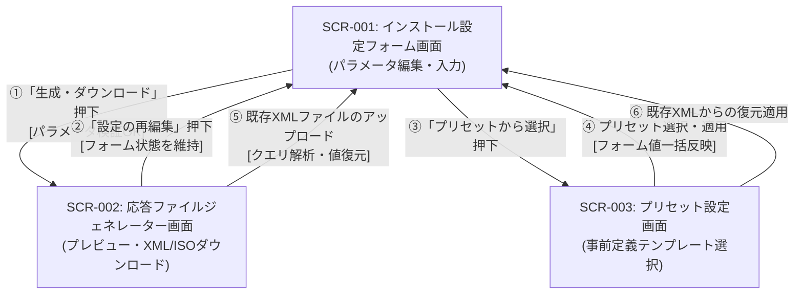

# 画面遷移

本ドキュメントは、Windows 無人セットアップ応答ファイル生成システム（`unattend-generator_ja-JP`）における画面間の遷移関係およびユーザー操作フローを定義したものです。

---

## 1. 画面遷移概要

本システムは、シングルページアプリケーション（SPA）形式で構築されており、基本操作は「インストール設定フォーム画面（SCR-001）」と「応答ファイルジェネレーター画面（SCR-002）」の相互遷移、および「プリセット設定画面（SCR-003）」からのパラメータ一括適用で構成されます。

- **初期ロード**: ユーザーがサイト（`/index.html`）にアクセスすると、デフォルトで日本語（ja-JP）・日本語106キーボード設定が初期適用された状態で「インストール設定フォーム画面（SCR-001）」が表示されます。
- **生成・プレビュー**: パラメータ編集後、「ダウンロード」または「プレビュー」を実行すると、入力された `FormData` がメモリ内で `GenerationContext` に渡され、「応答ファイルジェネレーター画面（SCR-002）」で XML 出力や ISO ダウンロードが実行されます。
- **テンプレート適用**: 「プリセット設定画面（SCR-003）」で特定用途のプリセットを選択すると、クエリ文字列経由で全フォームコントロールに一括適用され、SCR-001 へ戻ります。
- **設定復元（インポート）**: 過去の `autounattend.xml` をアップロードすると、`FormBridge` により先頭コメントからクエリがパースされ、SCR-001 のフォームが即時復元されます。

---

## 2. 画面遷移図 (Mermaid)

---

## 3. 画面遷移一覧表

| 遷移元画面 | 遷移先画面 | 操作 / トリガー | 遷移条件 / バリデーション | 引き渡しデータ | 画面表示・動作 |
| :--- | :--- | :--- | :--- | :--- | :--- |
| **SCR-001** | **SCR-002** | 「ダウンロード」または「ISOダウンロード」ボタン押下 | 必須項目（言語、アーキテクチャ、アカウント等）の入力検証が全て成功すること。 | `FormData`（フォーム入力値） | 応答ファイル生成エンジンが XML/ISO を構築し、ダウンロードダイアログ起動およびプレビュー描画。 |
| **SCR-002** | **SCR-001** | 「設定を再編集する」リンク押下 | なし（常時可能） | なし（現在のフォーム状態を保持） | プレビュー領域から入力フォームへフォーカスを戻し、再編集を可能にする。 |
| **SCR-001** | **SCR-003** | 「プリセット」ボタン押下 | なし（常時可能） | なし | プリセット一覧選択モーダル（またはセクション）を開く。 |
| **SCR-003** | **SCR-001** | プリセットカード選択後「適用」押下 | 目的のプリセットが選択されていること。 | プリセット定義クエリ文字列 | クエリをパースして SCR-001 の各入力項目に値を流し込み、メインフォームへ復帰。 |
| **SCR-002** | **SCR-001** | 既存 XML ファイルの D&D または選択 | 有効な `autounattend.xml` であり先頭コメントにクエリが存在すること。 | 抽出された設定パラメータ群 | フォーム各項目に値を復元し、ユーザーにインポート完了メッセージを表示。 |
