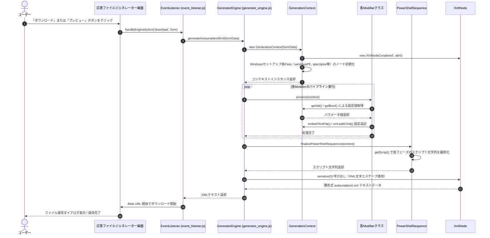
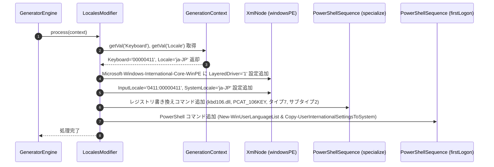
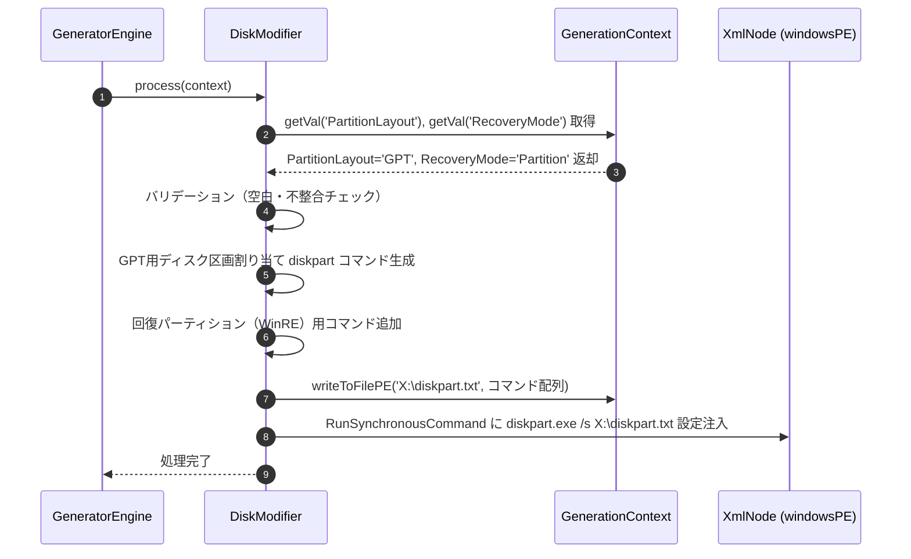
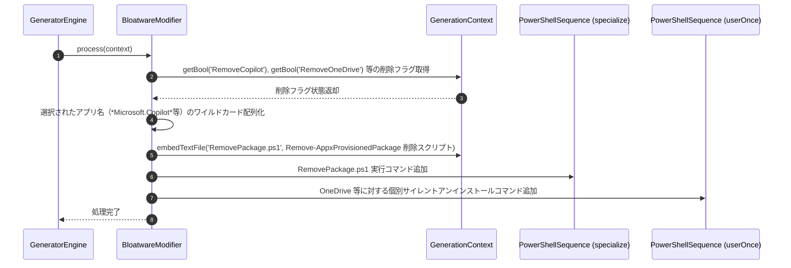

# シーケンス図

本ドキュメントは、Windows 無人セットアップ応答ファイル生成システム（`unattend-generator_ja-JP`）における主要な内部ロジックおよびモジュール間連携シーケンスを定義したものです。

---

## 1. 応答ファイル統合生成シーケンス
インストール設定フォームに入力された各種パラメータを解析し、無人セットアップで使用される自動応答ファイル（`autounattend.xml`）を一括構築して返却するフロー。

**参加者:**
- ユーザー (actor)
- 応答ファイルジェネレーター画面 (ui)
- EventListener (`event_listener.js`)
- GeneratorEngine (`generator_engine.js`)
- GenerationContext (`generation_context.js`)
- 各Modifierクラス (`ComputerName`, `Users` 等)
- PowerShellSequence (`powershell_sequence.js`)
- XmlNode (`xml_node.js`)

---

## 2. 日本語環境・キーボード最適化シーケンス
日本語（ja-JP）および日本語106/109キーボード特化設定と、レジストリ書き換えによる永続化コマンドを生成するフロー。

**参加者:**
- GeneratorEngine (`generator_engine.js`)
- LocalesModifier (`locales.js` / `LocalesModifier.cs`)
- GenerationContext (`generation_context.js`)
- XmlNode (windowsPE)
- PowerShellSequence (specialize)
- PowerShellSequence (firstLogon)

---

## 3. ディスク構成・パーティショニングシーケンス
指定されたディスク構成およびパーティションレイアウトに基づき、diskpart スクリプトを生成し、ターゲットディスクへの適用コマンドを組み込むフロー。

**参加者:**
- GeneratorEngine (`generator_engine.js`)
- DiskModifier (`disk.js` / `DiskModifier.cs`)
- GenerationContext (`generation_context.js`)
- XmlNode (windowsPE)

---

## 4. ブロートウェア自動削除シーケンス
セットアップ後にシステムのクリーンな状態を維持するため、指定されたプリインストールアプリを自動削除する PowerShell スクリプトを構築し、FirstLogon/Specialize シーケンスに登録するフロー。

**参加者:**
- GeneratorEngine (`generator_engine.js`)
- BloatwareModifier (`bloatware.js` / `BloatwareModifier.cs`)
- GenerationContext (`generation_context.js`)
- PowerShellSequence (specialize)
- PowerShellSequence (userOnce)

