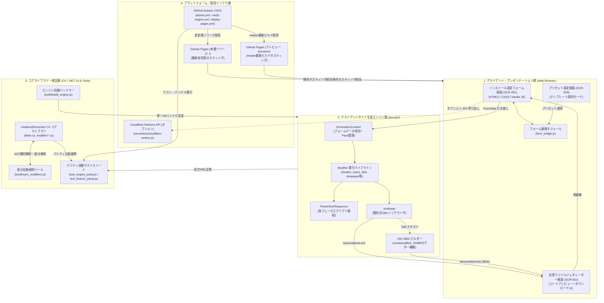

# アーキテクチャ構成図

本ドキュメントは、Windows 無人セットアップ（クリーンインストール）向け自動応答ファイル（`autounattend.xml`）および仮想ブートメディア（`autounattend.iso`）をブラウザまたは .NET 環境で生成する日本語環境特化型ジェネレーターシステム（`unattend-generator_ja-JP`）のアーキテクチャ全体像を定義したものです。

---

## 1. 全体アーキテクチャ図 (Mermaid)

---

## 2. 各レイヤーの責務と詳細コンポーネント

### 2.1 クライアント・プレゼンテーション層
- **責務**: ユーザー入力の受付、バリデーション、XML/ISOのダウンロード制御、設定インポートのUI提供。
- **主要モジュール**:
  - `docs/index.html`: メイン画面およびジェネレーター画面のDOM構造。
  - `docs/sections/*.html`: 各設定グループごとの分割HTMLテンプレート。
  - `docs/js/ui/form_bridge.js`: XMLヘッダーコメントとフォーム入力値の双方向同期。

### 2.2 クライアントサイド生成エンジン層
- **責務**: ブラウザのメモリ内だけで動作し、入力パラメータから整形式の `autounattend.xml` および ISO 9660 準拠の仮想メディア Blob を生成。
- **主要モジュール**:
  - `docs/js/core/generation_context.js`: フォーム入力値の保持とPassノード管理。
  - `docs/js/modifiers/*.js`: C# Modifier と 1対1 対応する各構成ロジック群（15件の専用モジュール＋統合モジュール）。
  - `docs/js/core/xml_node.js`: XML要素ツリーの構築とエスケープシリアライズ。
  - `docs/js/core/iso_builder.js`: 大容量設定でもヒープ50MB以下で動作する省メモリ型 ISO 9660 ビルダー。

### 2.3 コアライブラリ・検証層
- **責務**: C# による基準実装（Single Source of Truth）の提供、および JS エンジンとの出力完全一致（パリティ）の常時検証。
- **主要モジュール**:
  - `Main.cs`, `modifier/*.cs`: .NET 10 上で動作する高パフォーマンスな C# 実装。
  - `build/sync_modifiers.js`: C# と JS の Modifier 定義乖離を 100% 検知する検査ツール。
  - `test_tools/test_engine_parity.js`: 10 代表ケースでの差分0バイト検証。
  - `test_tools/test_feature_parity.js`: 54 項目の機能・構文等価性テスト。

### 2.4 プラットフォーム・配信インフラ層
- **責務**: CI/CD による自動テスト・自動バンドル、GitHub Pages での安全なマルチ環境静的ホスティング。
- **主要モジュール**:
  - `.github/workflows/verify-engine.yml`: CIパイプライン（C#ビルド、パリティテスト）。
  - `.github/workflows/deploy-pages.yml`: CDパイプライン（本番/プレビュー論理分離デプロイ）。
  - `serverless/cloudflare-worker.js`: サーバーレス環境での API 提供テンプレート。
