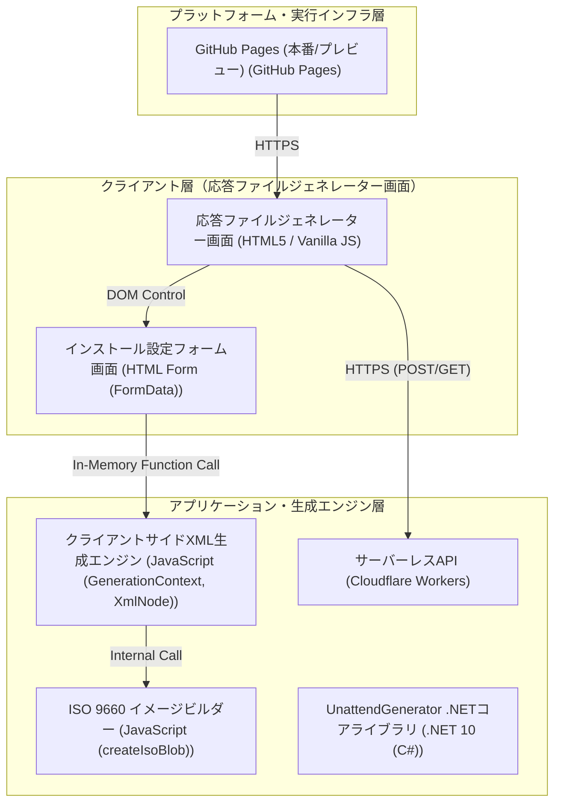

# アーキテクチャ構成図

Windows無人セットアップ（クリーンインストール）向け自動応答ファイル（autounattend.xml）をブラウザまたは.NET環境で生成する、日本語環境特化型ジェネレーターシステム。

**クライアント層（応答ファイルジェネレーター画面）:**
- 応答ファイルジェネレーター画面 [HTML5 / Vanilla JS]
- インストール設定フォーム画面 [HTML Form (FormData)]

**アプリケーション・生成エンジン層:**
- クライアントサイドXML生成エンジン [JavaScript (GenerationContext, XmlNode)]
- ISO 9660 イメージビルダー [JavaScript (createIsoBlob)]
- UnattendGenerator .NETコアライブラリ [.NET 10 (C#)]
- サーバーレスAPI [Cloudflare Workers]

**プラットフォーム・実行インフラ層:**
- GitHub Pages (本番/プレビュー) [GitHub Pages]

**接続:**
- 応答ファイルジェネレーター画面 → インストール設定フォーム画面 (DOM Control)
- インストール設定フォーム画面 → クライアントサイドXML生成エンジン (In-Memory Function Call)
- クライアントサイドXML生成エンジン → ISO 9660 イメージビルダー (Internal Call)
- 応答ファイルジェネレーター画面 → サーバーレスAPI (HTTPS (POST/GET))
- GitHub Pages (本番/プレビュー) → 応答ファイルジェネレーター画面 (HTTPS)

