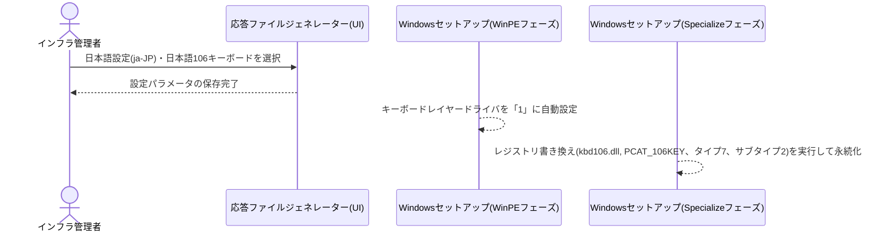
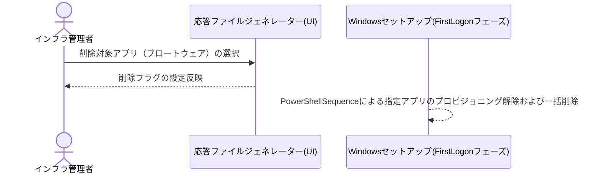
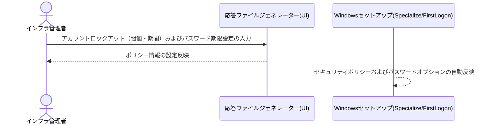
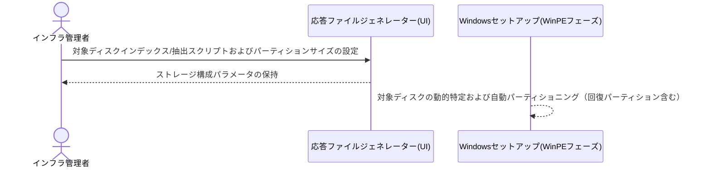
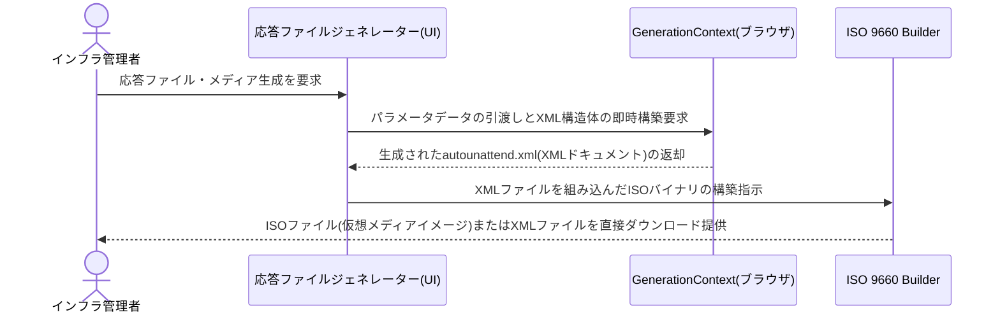
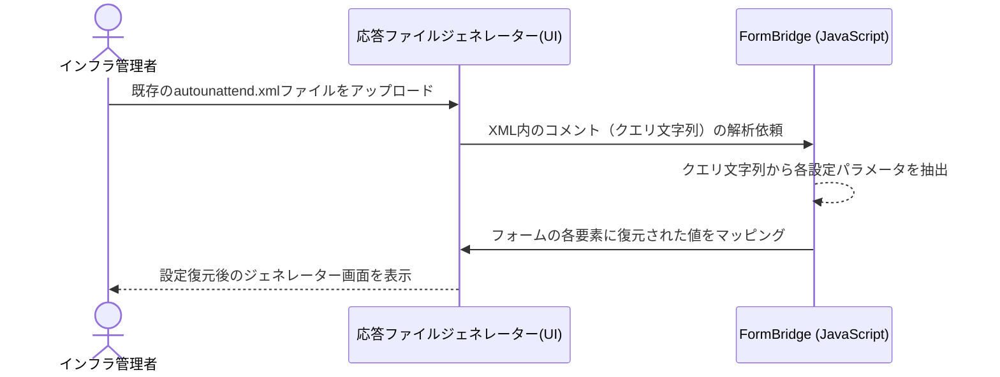
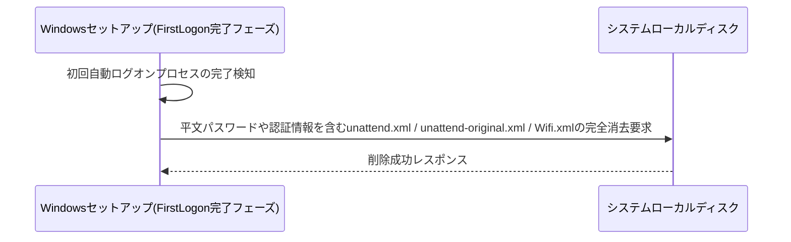
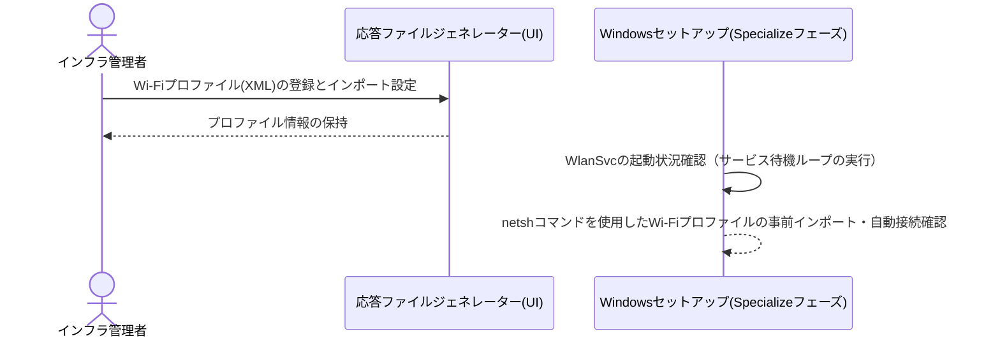
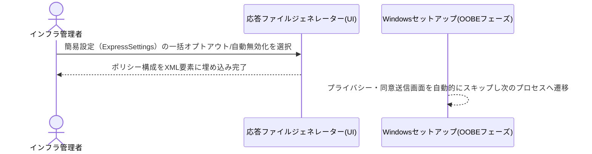
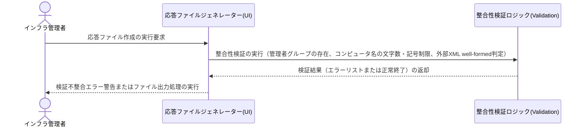

# 業務フロー

## キーボード・地域設定

日本語環境（ja-JP）における106日本語キーボードの自動適用およびレジストリ書き換えによる永続化フロー

**参加者:** インフラ管理者 (actor)、応答ファイルジェネレーター(UI) (system)、Windowsセットアップ(WinPEフェーズ) (system)、Windowsセットアップ(Specializeフェーズ) (system)

**メッセージフロー:**
- インフラ管理者 → 応答ファイルジェネレーター(UI): 日本語設定(ja-JP)・日本語106キーボードを選択
  - 応答ファイルジェネレーター(UI) ← インフラ管理者: 設定パラメータの保存完了
- Windowsセットアップ(WinPEフェーズ) → Windowsセットアップ(WinPEフェーズ): キーボードレイヤードライバを「1」に自動設定
- Windowsセットアップ(Specializeフェーズ) → Windowsセットアップ(Specializeフェーズ): レジストリ書き換え(kbd106.dll, PCAT_106KEY、タイプ7、サブタイプ2)を実行して永続化

## システム最適化

不要なプリインストールアプリ（Teams、OneDrive、Xbox関連等）を指定し、無人セットアップ中に自動でアンインストールするフロー

**参加者:** インフラ管理者 (actor)、応答ファイルジェネレーター(UI) (system)、Windowsセットアップ(FirstLogonフェーズ) (system)

**メッセージフロー:**
- インフラ管理者 → 応答ファイルジェネレーター(UI): 削除対象アプリ（ブロートウェア）の選択
  - 応答ファイルジェネレーター(UI) ← インフラ管理者: 削除フラグの設定反映
- Windowsセットアップ(FirstLogonフェーズ) → Windowsセットアップ(FirstLogonフェーズ): PowerShellSequenceによる指定アプリのプロビジョニング解除および一括削除

## アカウント・セキュリティ

ローカルアカウントに対するパスワードポリシーおよびアカウントロックアウトの適用フロー

**参加者:** インフラ管理者 (actor)、応答ファイルジェネレーター(UI) (system)、Windowsセットアップ(Specialize/FirstLogon) (system)

**メッセージフロー:**
- インフラ管理者 → 応答ファイルジェネレーター(UI): アカウントロックアウト（閾値・期間）およびパスワード期限設定の入力
  - 応答ファイルジェネレーター(UI) ← インフラ管理者: ポリシー情報の設定反映
- Windowsセットアップ(Specialize/FirstLogon) → Windowsセットアップ(Specialize/FirstLogon): セキュリティポリシーおよびパスワードオプションの自動反映

## ストレージ構成

対象ディスクの特定およびMBR/GPTパーティション構成の自動構成フロー

**参加者:** インフラ管理者 (actor)、応答ファイルジェネレーター(UI) (system)、Windowsセットアップ(WinPEフェーズ) (system)

**メッセージフロー:**
- インフラ管理者 → 応答ファイルジェネレーター(UI): 対象ディスクインデックス/抽出スクリプトおよびパーティションサイズの設定
  - 応答ファイルジェネレーター(UI) ← インフラ管理者: ストレージ構成パラメータの保持
- Windowsセットアップ(WinPEフェーズ) → Windowsセットアップ(WinPEフェーズ): 対象ディスクの動的特定および自動パーティショニング（回復パーティション含む）

## UI・操作環境最適化

クラシックコンテキストメニュー有効化や拡張子常時表示など、デスクトップ環境の自動カスタマイズフロー

**参加者:** インフラ管理者 (actor)、応答ファイルジェネレーター(UI) (system)、Windowsセットアップ(FirstLogonフェーズ) (system)

**メッセージフロー:**
- インフラ管理者 → 応答ファイルジェネレーター(UI): UI最適化（クラシックメニュー、拡張子表示、壁紙など）を設定
  - 応答ファイルジェネレーター(UI) ← インフラ管理者: 操作環境パラメータの保持
- Windowsセットアップ(FirstLogonフェーズ) → Windowsセットアップ(FirstLogonフェーズ): レジストリ書き換えおよびPowerShellによる初期ログイン時環境適用

## ファイル生成・出力

ブラウザ内GenerationContextによる応答ファイル(autounattend.xml)の即時構成とISOパッケージの生成・ダウンロードフロー

**参加者:** インフラ管理者 (actor)、応答ファイルジェネレーター(UI) (system)、GenerationContext(ブラウザ) (system)、ISO 9660 Builder (system)

**メッセージフロー:**
- インフラ管理者 → 応答ファイルジェネレーター(UI): 応答ファイル・メディア生成を要求
- 応答ファイルジェネレーター(UI) → GenerationContext(ブラウザ): パラメータデータの引渡しとXML構造体の即時構築要求
  - GenerationContext(ブラウザ) ← 応答ファイルジェネレーター(UI): 生成されたautounattend.xml(XMLドキュメント)の返却
- 応答ファイルジェネレーター(UI) → ISO 9660 Builder: XMLファイルを組み込んだISOバイナリの構築指示
  - ISO 9660 Builder ← インフラ管理者: ISOファイル(仮想メディアイメージ)またはXMLファイルを直接ダウンロード提供

## 設定管理

過去に作成した応答ファイルを読み込み、UIフォームへ瞬時に設定値を復元するインポートフロー

**参加者:** インフラ管理者 (actor)、応答ファイルジェネレーター(UI) (system)、FormBridge (JavaScript) (system)

**メッセージフロー:**
- インフラ管理者 → 応答ファイルジェネレーター(UI): 既存のautounattend.xmlファイルをアップロード
- 応答ファイルジェネレーター(UI) → FormBridge (JavaScript): XML内のコメント（クエリ文字列）の解析依頼
- FormBridge (JavaScript) → FormBridge (JavaScript): クエリ文字列から各設定パラメータを抽出
- FormBridge (JavaScript) → 応答ファイルジェネレーター(UI): フォームの各要素に復元された値をマッピング
  - 応答ファイルジェネレーター(UI) ← インフラ管理者: 設定復元後のジェネレーター画面を表示

## セキュリティ保護

自動セットアップ完了時、媒体に残る平文パスワードなどの機密ファイル（unattend.xml等）を強制削除する保護フロー

**参加者:** Windowsセットアップ(FirstLogon完了フェーズ) (system)、システムローカルディスク (database)

**メッセージフロー:**
- Windowsセットアップ(FirstLogon完了フェーズ) → Windowsセットアップ(FirstLogon完了フェーズ): 初回自動ログオンプロセスの完了検知
- Windowsセットアップ(FirstLogon完了フェーズ) → システムローカルディスク: 平文パスワードや認証情報を含むunattend.xml / unattend-original.xml / Wifi.xmlの完全消去要求
  - システムローカルディスク ← Windowsセットアップ(FirstLogon完了フェーズ): 削除成功レスポンス

## ネットワーク設定

セットアップ段階でのWi-Fi通信自動構成と、ネットワークサービス(WlanSvc)起動待機・接続検証フロー

**参加者:** インフラ管理者 (actor)、応答ファイルジェネレーター(UI) (system)、Windowsセットアップ(Specializeフェーズ) (system)

**メッセージフロー:**
- インフラ管理者 → 応答ファイルジェネレーター(UI): Wi-Fiプロファイル(XML)の登録とインポート設定
  - 応答ファイルジェネレーター(UI) ← インフラ管理者: プロファイル情報の保持
- Windowsセットアップ(Specializeフェーズ) → Windowsセットアップ(Specializeフェーズ): WlanSvcの起動状況確認（サービス待機ループの実行）
- Windowsセットアップ(Specializeフェーズ) → Windowsセットアップ(Specializeフェーズ): netshコマンドを使用したWi-Fiプロファイルの事前インポート・自動接続確認

## セットアッププロセス制御

Windows OOBE初回起動時における簡易設定（ExpressSettingsMode）の一括無効化（オプトアウト）および制御フロー

**参加者:** インフラ管理者 (actor)、応答ファイルジェネレーター(UI) (system)、Windowsセットアップ(OOBEフェーズ) (system)

**メッセージフロー:**
- インフラ管理者 → 応答ファイルジェネレーター(UI): 簡易設定（ExpressSettings）の一括オプトアウト/自動無効化を選択
  - 応答ファイルジェネレーター(UI) ← インフラ管理者: ポリシー構成をXML要素に埋め込み完了
- Windowsセットアップ(OOBEフェーズ) → Windowsセットアップ(OOBEフェーズ): プライバシー・同意送信画面を自動的にスキップし次のプロセスへ遷移

## バリデーション・統制

応答ファイル生成前に入力パラメータの不整合（管理者有無、コンピュータ名制限等）を自動判定する検証フロー

**参加者:** インフラ管理者 (actor)、応答ファイルジェネレーター(UI) (system)、整合性検証ロジック(Validation) (system)

**メッセージフロー:**
- インフラ管理者 → 応答ファイルジェネレーター(UI): 応答ファイル作成の実行要求
- 応答ファイルジェネレーター(UI) → 整合性検証ロジック(Validation): 整合性検証の実行（管理者グループの存在、コンピュータ名の文字数・記号制限、外部XML well-formed判定）
  - 整合性検証ロジック(Validation) ← 応答ファイルジェネレーター(UI): 検証結果（エラーリストまたは正常終了）の返却
  - 応答ファイルジェネレーター(UI) ← インフラ管理者: 検証不整合エラー警告またはファイル出力処理の実行

