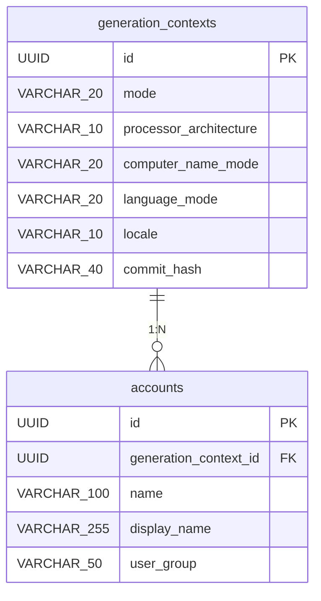

# ER図

自動応答ファイルの生成を管理するコンテキスト（generation_contexts）と、その中で作成される複数のローカルユーザーアカウント設定（accounts）の間の1対多のリレーションシップ。

### エンティティ一覧

**GENERATION_CONTEXTS**

| カラム名 | データ型 | キー |
| --- | --- | --- |
| id | UUID | PK |
| mode | VARCHAR(20) |  |
| processor_architecture | VARCHAR(10) |  |
| computer_name_mode | VARCHAR(20) |  |
| language_mode | VARCHAR(20) |  |
| locale | VARCHAR(10) |  |
| commit_hash | VARCHAR(40) |  |

**ACCOUNTS**

| カラム名 | データ型 | キー |
| --- | --- | --- |
| id | UUID | PK |
| generation_context_id | UUID | FK |
| name | VARCHAR(100) |  |
| display_name | VARCHAR(255) |  |
| user_group | VARCHAR(50) |  |

### リレーション

- GENERATION_CONTEXTS → ACCOUNTS (1:N)

### ER図

