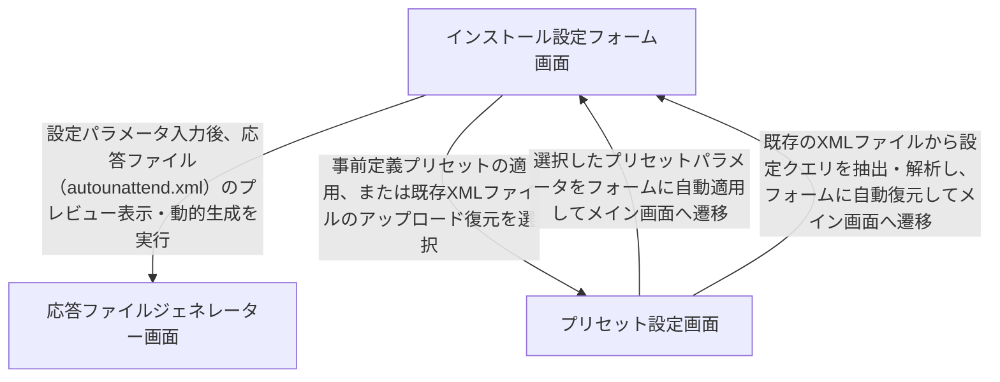

# 画面遷移

本アプリケーションは、無人セットアップ用自動応答ファイル（autounattend.xml）を日本語環境向けにカスタマイズ・生成するクライアントサイドツールです。「インストール設定フォーム画面 (SCR-001)」でキーボード配列やアカウント、パーティションレイアウトなどのパラメータを入力し、「応答ファイルジェネレーター画面 (SCR-002)」でプレビューやXML/ISOダウンロードを行います。また、事前定義プリセットの適用や、既存XMLからのフォーム設定自動復元を行うために「プリセット設定画面 (SCR-003)」へと遷移し、相互にパラメータを連携させながら遷移する構造となっています。

**フロー:**
- インストール設定フォーム画面 → 応答ファイルジェネレーター画面 (設定パラメータ入力後、応答ファイル（autounattend.xml）のプレビュー表示・動的生成を実行)
- インストール設定フォーム画面 → プリセット設定画面 (事前定義プリセットの適用、または既存XMLファイルのアップロード復元を選択)
- プリセット設定画面 → インストール設定フォーム画面 (選択したプリセットパラメータをフォームに自動適用してメイン画面へ遷移)
- プリセット設定画面 → インストール設定フォーム画面 (既存のXMLファイルから設定クエリを抽出・解析し、フォームに自動復元してメイン画面へ遷移)

