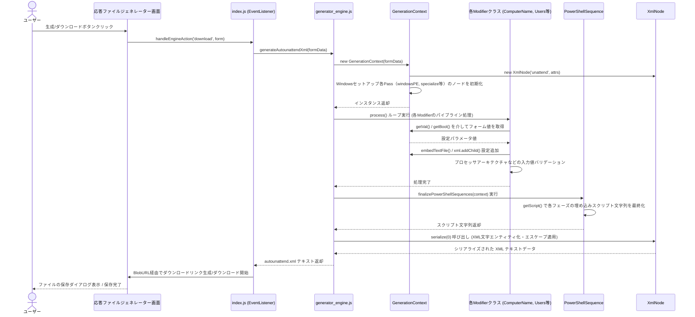
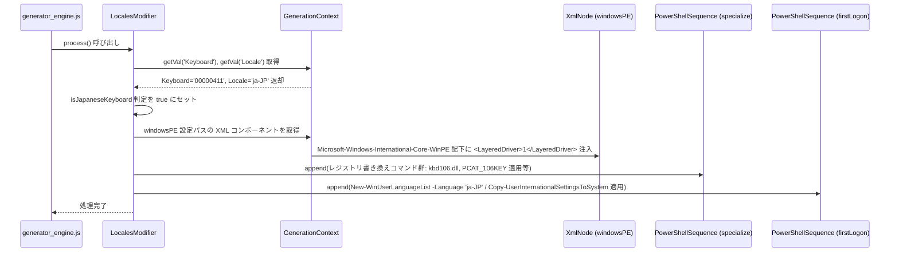
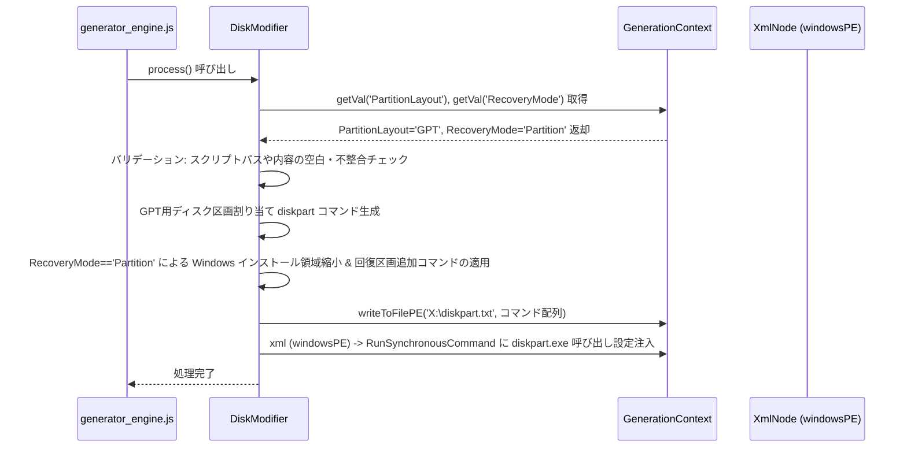
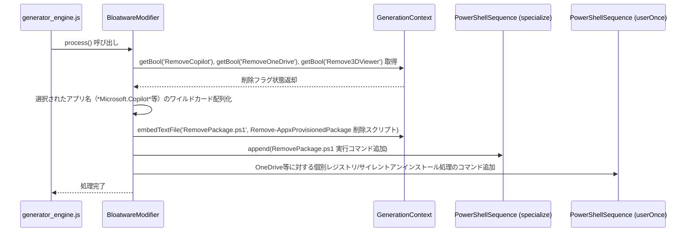

# シーケンス図

## 応答ファイル生成

インストール設定フォームに入力された各種パラメータを解析し、無人セットアップで使用される自動応答ファイル（autounattend.xml）を一括構築して返却する。

**参加者:** ユーザー (actor)、応答ファイルジェネレーター画面 (system)、index.js (EventListener) (system)、generator_engine.js (system)、GenerationContext (system)、各Modifierクラス (ComputerName, Users等) (system)、PowerShellSequence (system)、XmlNode (system)

**メッセージフロー:**
- ユーザー → 応答ファイルジェネレーター画面: 生成/ダウンロードボタンクリック
- 応答ファイルジェネレーター画面 → index.js (EventListener): handleEngineAction('download', form)
- index.js (EventListener) → generator_engine.js: generateAutounattendXml(formData)
- generator_engine.js → GenerationContext: new GenerationContext(formData)
- GenerationContext → XmlNode: new XmlNode('unattend', attrs)
- GenerationContext → GenerationContext: Windowsセットアップ各Pass（windowsPE, specialize等）のノードを初期化
  - GenerationContext ← generator_engine.js: インスタンス返却
- generator_engine.js → 各Modifierクラス (ComputerName, Users等): process() ループ実行 (各Modifierのパイプライン処理)
- 各Modifierクラス (ComputerName, Users等) → GenerationContext: getVal() / getBool() を介してフォーム値を取得
  - GenerationContext ← 各Modifierクラス (ComputerName, Users等): 設定パラメータ値
- 各Modifierクラス (ComputerName, Users等) → GenerationContext: embedTextFile() / xml.addChild() 設定追加
- 各Modifierクラス (ComputerName, Users等) → 各Modifierクラス (ComputerName, Users等): プロセッサアーキテクチャなどの入力値バリデーション
  - 各Modifierクラス (ComputerName, Users等) ← generator_engine.js: 処理完了
- generator_engine.js → PowerShellSequence: finalizePowerShellSequences(context) 実行
- PowerShellSequence → PowerShellSequence: getScript() で各フェーズの埋め込みスクリプト文字列を最終化
  - PowerShellSequence ← generator_engine.js: スクリプト文字列返却
- generator_engine.js → XmlNode: serialize(0) 呼び出し (XML文字エンティティ化・エスケープ適用)
  - XmlNode ← generator_engine.js: シリアライズされた XML テキストデータ
  - generator_engine.js ← index.js (EventListener): autounattend.xml テキスト返却
- index.js (EventListener) → 応答ファイルジェネレーター画面: BlobURL経由でダウンロードリンク生成/ダウンロード開始
  - 応答ファイルジェネレーター画面 ← ユーザー: ファイルの保存ダイアログ表示 / 保存完了

## 日本語環境設定

無人セットアップ時の言語およびキーボード設定において、日本語(ja-JP)および日本語キーボード用の特化設定と、文字化けやレジストリ不整合を防ぐ自動コマンドを生成する。

**参加者:** generator_engine.js (system)、LocalesModifier (system)、GenerationContext (system)、XmlNode (windowsPE) (system)、PowerShellSequence (specialize) (system)、PowerShellSequence (firstLogon) (system)

**メッセージフロー:**
- generator_engine.js → LocalesModifier: process() 呼び出し
- LocalesModifier → GenerationContext: getVal('Keyboard'), getVal('Locale') 取得
  - GenerationContext ← LocalesModifier: Keyboard='00000411', Locale='ja-JP' 返却
- LocalesModifier → LocalesModifier: isJapaneseKeyboard 判定を true にセット
- LocalesModifier → GenerationContext: windowsPE 設定パスの XML コンポーネントを取得
- GenerationContext → XmlNode (windowsPE): Microsoft-Windows-International-Core-WinPE 配下に <LayeredDriver>1</LayeredDriver> 注入
- LocalesModifier → PowerShellSequence (specialize): append(レジストリ書き換えコマンド群: kbd106.dll, PCAT_106KEY 適用等)
- LocalesModifier → PowerShellSequence (firstLogon): append(New-WinUserLanguageList -Language 'ja-JP' / Copy-UserInternationalSettingsToSystem 適用)
  - LocalesModifier ← generator_engine.js: 処理完了

## ディスク構成設定

指定されたディスク構成およびパーティションレイアウトに基づき、diskpartスクリプトを生成し、ターゲットディスクへの適用コマンドを組み込む。

**参加者:** generator_engine.js (system)、DiskModifier (system)、GenerationContext (system)、XmlNode (windowsPE) (system)

**メッセージフロー:**
- generator_engine.js → DiskModifier: process() 呼び出し
- DiskModifier → GenerationContext: getVal('PartitionLayout'), getVal('RecoveryMode') 取得
  - GenerationContext ← DiskModifier: PartitionLayout='GPT', RecoveryMode='Partition' 返却
- DiskModifier → DiskModifier: バリデーション: スクリプトパスや内容の空白・不整合チェック
- DiskModifier → DiskModifier: GPT用ディスク区画割り当て diskpart コマンド生成
- DiskModifier → DiskModifier: RecoveryMode=='Partition' による Windows インストール領域縮小 & 回復区画追加コマンドの適用
- DiskModifier → GenerationContext: writeToFilePE('X:\diskpart.txt', コマンド配列)
- DiskModifier → GenerationContext: xml (windowsPE) -> RunSynchronousCommand に diskpart.exe 呼び出し設定注入
  - DiskModifier ← generator_engine.js: 処理完了

## ブロートウェア削除

セットアップ後にシステムのクリーンな状態を維持するため、指定されたプリインストールアプリを自動削除するPowerShellスクリプトを構築し、FirstLogon/Specialize シーケンスに登録する。

**参加者:** generator_engine.js (system)、BloatwareModifier (system)、GenerationContext (system)、PowerShellSequence (specialize) (system)、PowerShellSequence (userOnce) (system)

**メッセージフロー:**
- generator_engine.js → BloatwareModifier: process() 呼び出し
- BloatwareModifier → GenerationContext: getBool('RemoveCopilot'), getBool('RemoveOneDrive'), getBool('Remove3DViewer') 取得
  - GenerationContext ← BloatwareModifier: 削除フラグ状態返却
- BloatwareModifier → BloatwareModifier: 選択されたアプリ名（*Microsoft.Copilot*等）のワイルドカード配列化
- BloatwareModifier → GenerationContext: embedTextFile('RemovePackage.ps1', Remove-AppxProvisionedPackage 削除スクリプト)
- BloatwareModifier → PowerShellSequence (specialize): append(RemovePackage.ps1 実行コマンド追加)
- BloatwareModifier → PowerShellSequence (userOnce): OneDrive等に対する個別レジストリ/サイレントアンインストール処理のコマンド追加
  - BloatwareModifier ← generator_engine.js: 処理完了

