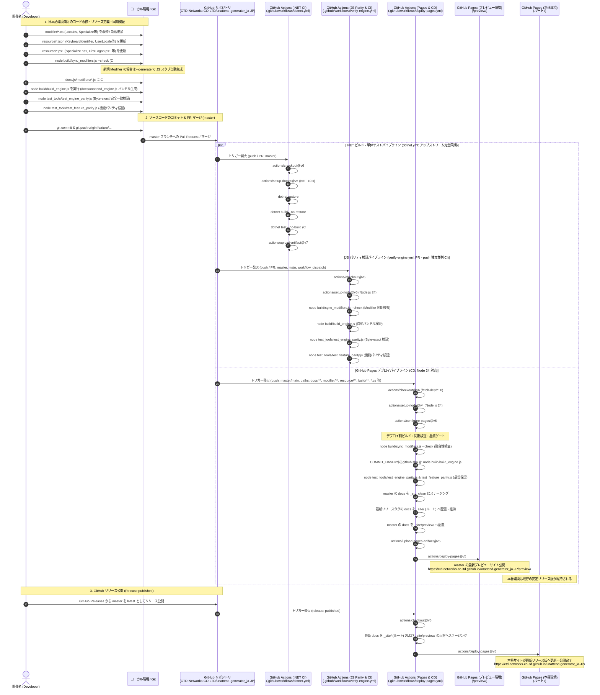
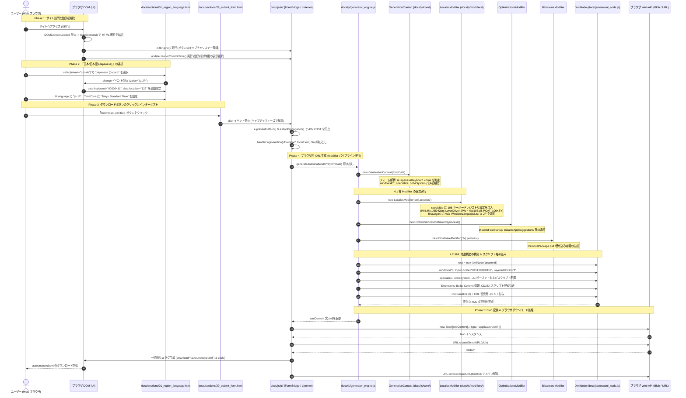

# `unattend-generator_ja-JP`アーキテクチャ＆シーケンス説明

本ドキュメントは、**`CTD-Networks-CO-LTD/unattend-generator_ja-JP`** における Web サイト生成（CI/CD ビルド・デプロイ）および、同サイト上での「日本/日本語 (Japanese)」環境をシミュレートした `autounattend.xml` 生成・ダウンロードまでの一連の動作を、Mermaid シーケンス図および詳細なコード解説により図説・文書化したものです。

特に、オリジナルの C# (.NET 10) サーバー側実装からクライアントサイド JavaScript エンジンへの移植（CS→JS変換）構造、モジュール分割アーキテクチャ、およびパリティ検証の仕組みについて解説します。

---

## 目次

- [`unattend-generator_ja-JP`アーキテクチャ＆シーケンス説明](#unattend-generator_ja-jpアーキテクチャシーケンス説明)
  - [目次](#目次)
  - [1. 全体概要とリポジトリ構成](#1-全体概要とリポジトリ構成)
  - [2. シーケンス図 1: サイト生成・GitHub Actions デプロイフロー](#2-シーケンス図-1-サイト生成github-actions-デプロイフロー)
    - [2.1 Mermaid シーケンス図](#21-mermaid-シーケンス図)
    - [2.2 詳細解説（ソースコード・リソースと CI/CD の連携）](#22-詳細解説ソースコードリソースと-cicd-の連携)
      - [1. 資材・コードベースの役割分担一覧](#1-資材コードベースの役割分担一覧)
      - [2. ビルド＆自動バンドラー（build_engine.js / build_engine.ps1）](#2-ビルド自動バンドラーbuild_enginejs--build_engineps1)
      - [3. GitHub Actions CI/CD パイプラインの連携](#3-github-actions-cicd-パイプラインの連携)
  - [3. シーケンス図 2: 「日本/日本語」設定から autounattend.xml をダウンロードするまでの動作](#3-シーケンス図-2-日本日本語設定から-autounattendxml-をダウンロードするまでの動作)
    - [3.1 Mermaid シーケンス図](#31-mermaid-シーケンス図)
    - [3.2 詳細解説（ステップごとのコード呼び出しと日本語固有パラメータ）](#32-詳細解説ステップごとのコード呼び出しと日本語固有パラメータ)
      - [Phase 1: サイト訪問と動的初期化](#phase-1-サイト訪問と動的初期化)
      - [Phase 2: 言語とキーボードの選択（日本/日本語シミュレート）](#phase-2-言語とキーボードの選択日本日本語シミュレート)
      - [Phase 3: ダウンロードボタンのクリックとインターセプト](#phase-3-ダウンロードボタンのクリックとインターセプト)
      - [Phase 4: ブラウザ内 XML 生成ロジック（`generateAutounattendXml`）](#phase-4-ブラウザ内-xml-生成ロジックgenerateautounattendxml)
      - [Phase 5: Blob 変換 & ブラウザダウンロード処理](#phase-5-blob-変換--ブラウザダウンロード処理)
  - [4. C# 実装とクライアント JavaScript（CS→JS 変換）の対応関係](#4-c-実装とクライアント-javascriptcsjs-変換の対応関係)
    - [4.1 CS→JS 変換アーキテクチャの概要](#41-csjs-変換アーキテクチャの概要)
    - [4.2 コアインフラおよびデータ構造の対応](#42-コアインフラおよびデータ構造の対応)
    - [4.3 C# Modifier クラスと JS モジュールの 1対1 対応マトリクス](#43-c-modifier-クラスと-js-モジュールの-1対1-対応マトリクス)
    - [4.4 パリティ検証システム（完全一致検証）](#44-パリティ検証システム完全一致検証)
    - [4.5 C# ソースコード変更・新規追加時の自動同期・検証パイプライン（sync_modifiers.js）](#45-c-ソースコード変更新規追加時の自動同期検証パイプラインsync_modifiersjs)

---

## 1. 全体概要とリポジトリ構成

- **Webサイト公開 URL**:
  - **本番環境（最新リリース版）**: `https://ctd-networks-co-ltd.github.io/unattend-generator_ja-JP/`
  - **プレビュー環境（master最新ビルド版）**: `https://ctd-networks-co-ltd.github.io/unattend-generator_ja-JP/preview/`
- **GitHub リポジトリ**: `https://github.com/CTD-Networks-CO-LTD/unattend-generator_ja-JP`
- **アーキテクチャの要点**:
  - 本リポジトリは、Windows 無人応答ファイル（`autounattend.xml`）生成ツール（元リポジトリ: `cschneegans/unattend-generator`）をフォークし、**日本語キーボード（106/109 キー配列、`kbd106.dll`、`PCAT_106KEY`）や IME、日本のロケール・タイムゾーンに最適化した日本語特化版**です。
  - GitHub Pages という静的 Web ホスティング環境で動作させるため、本来 C# (.NET) サーバー側で行っていた XML 生成エンジン（Modifier クラス群や埋め込みリソース）のロジックが、**C# のクラス構造と 1対1 に対応するモジュール分割されたクライアントサイド JavaScript（`docs/js/`）として移植**されています。
  - ビルドスクリプト（`build/build_engine.js` / `build_engine.ps1`）により、モジュール分割コードから単一の配信ファイル（`docs/unattend_engine.js`）が自動バンドルされ、Git コミット情報やリリース情報が同期されます。
  - ユーザーのブラウザ上で全ての XML 構築・Blob 生成が行われるため、外部 API サーバーやバックエンドを必要とせず、完全オフライン／クライアント完結で動作します。

## 2. シーケンス図 1: サイト生成・GitHub Actions デプロイフロー

C# ソースコード（`modifier/*.cs`）、リソースファイル群（`resource/*.json`, `resource/*.ps1`）、分割 JS モジュール群（`docs/js/`）、分割 HTML テンプレート群が、ビルド＆バンドル処理および GitHub Actions を経て GitHub Pages サイトとして公開されるまでのフローです。

### 2.1 Mermaid シーケンス図



### 2.2 詳細解説（ソースコード・リソースと CI/CD の連携）

#### 1. 資材・コードベースの役割分担一覧

| 資材 / ファイルパス | 種別 / 実行環境 | 主な役割・機能 | 日本語化・静的化対応の内容 |
| :--- | :--- | :--- | :--- |
| **`modifier/*.cs`** | C# ソースコード<br/>(.NET 10 Core) | Windows セットアップ構成パス（`windowsPE`, `specialize`, `oobeSystem`）ごとに `autounattend.xml` の XML DOM を生成・操作するバックエンド実装群 | `Locales.cs` や `Optimizations.cs` 等において、日本語環境（106/109 キーボード、`kbd106.dll`、`PCAT_106KEY`、`ja-JP`）の要素挿入やレジストリ制御スクリプトの追加ロジックを実装 |
| **`resource/*.json`** | 定義データ<br/>(アセンブリ埋め込み JSON) | キーボード配列、ロケール、GeoLocation、UI 表示言語、タイムゾーン、削除対象ブロートウェア等のマスター定義データ | `KeyboardIdentifier.json`（日本語キーボード `00000411` や IME 定義）、`UserLocale.json`（LCID `0411`、日本 GeoLocation `122`、`ja-JP`）等の定義を追加・最適化 |
| **`resource/*.ps1`** | PowerShell テンプレート<br/>(インストール時実行スクリプト) | Windows インストール中および初回ログイン時に実行される PowerShell スクリプト | `Specialize.ps1` や `FirstLogon.ps1` に 106/109 キーボード強制レジストリや言語リスト（`New-WinUserLanguageList`）登録処理を追加 |
| **`docs/js/modifiers/*.js`** | JavaScript モジュール<br/>(フロントエンド設計) | C# `modifier/*.cs` の各クラスを 1対1 でクライアントサイドに移植したモジュール群 | `locales.js`, `optimizations.js`, `bloatware.js` 等により、ブラウザ内で C# と完全等価な XML / スクリプトを生成 |
| **`docs/js/core/*.js`** | JavaScript モジュール<br/>(基底インフラ) | XML DOM 構築（`xml_node.js`）、PowerShell シーケンス（`powershell_sequence.js`）、生成コンテキスト（`generation_context.js`）等 | 外部ライブラリに依存せず、決定論的なインデント・改行（CRLF）と状態管理を提供 |
| **`docs/js/generator_engine.js`** | JavaScript エンジン<br/>(パイプライン統轄) | C# の `UnattendGenerator.cs` に相当する XML 構築コーディネーター | 全 Modifier を正しい順序で実行し、XML 階層構造の組み立てと URL クエリ復元コメントの付与を実行 |
| **`docs/unattend_engine.js`** | 統合バンドル JS<br/>(配信用成果物) | `docs/js/` 配下の全モジュールを 1 ファイルにバンドルした実行ファイル | GitHub Pages 上での `405 Method Not Allowed` を防止。ブラウザ内で直接 `autounattend.xml` を組み立て即座にダウンロード |
| **`build/build_engine.js`**<br/>**`build/build_engine.ps1`** | ビルド＆バンドラー<br/>(Node.js / PowerShell) | 分割モジュール（`docs/js/`）を `docs/unattend_engine.js` に自動バンドル | 最新の Git コミットハッシュ、リポジトリ URL、リリースタグ、コミット日時を抽出し、`constants.js` やヘッダーに自動同期 |
| **`build/sync_modifiers.js`** | 自動同期・差分検知ツール<br/>(Node.js スクリプト) | C#（`modifier/*.cs`）と JS（`docs/js/modifiers/*.js`）の同期検証（`--check`）、マッピング一覧表示（`--list`）、および新規 Modifier 追加時の JS スタブ自動生成・登録（`--generate`）を担当 | C# 側の変更や新規追加に対して JS 側の更新漏れ・デグレを未然に防ぎ、完全なパリティを自動維持 |
| **`test_tools/test_engine_parity.js`** | パリティ検証テスト<br/>(Node.js スクリプト) | モジュール分割版とベースラインエンジンの生成結果を比較 | 10 種類の代表的ユースケースで Byte-exact（1バイトの狂いもない完全一致）を検証 |
| **`test_tools/test_feature_parity.js`** | 機能検証テスト<br/>(Node.js スクリプト) | C# と JS の機能格差解消およびスマートクォート排除の網羅テスト | 54 項目に及ぶ機能パリティ、構文安全性、自リポジトリ URL リンクを自動検収 |

#### 2. ビルド＆自動バンドラー（build_engine.js / build_engine.ps1）

開発時はメンテナンス性の高いモジュール分割コード（`docs/js/`）として管理し、ビルドスクリプトを実行することで配信用の単一ファイル（`docs/unattend_engine.js`）を生成します。

1. **Git メタデータの抽出と同期**:
   `git rev-parse HEAD`、リモート URL、最新タグ、コミット日時を取得し、`docs/js/core/constants.js`、`test_tools/baseline_unattend_engine.js`、および `docs/sections/header.html` を同期します。
2. **モジュールの順序付きバンドル**:
   依存関係の順序（`core/` → `modifiers/` → `generator_engine.js` → `ui/` → `index.js`）に従い、IIFE（即時実行関数式）でラップした単一ファイルを生成します。
3. **改行コードの統一**:
   出力されるバンドルファイルの改行コードを CRLF (`\r\n`) に統一します。

#### 3. GitHub Actions CI/CD パイプラインの連携

| ワークフロー定義 | 種別 | トリガー条件 | 実行内容・役割 |
| :--- | :--- | :--- | :--- |
| **`.github/workflows/dotnet.yml`** | CI<br/>(継続的インテグレーション) | `master` への push、Pull Request | **C# Core ビルド＆単体テスト（アップストリーム完全一致）**:<br/>1. .NET 10 環境で `UnattendGenerator.csproj` を依存関係復元・ビルド（`dotnet build`）および単体テスト（`dotnet test`）を実行。<br/>2. ビルド成果物のアップロード（`actions/upload-artifact@v7`）。<br/>※アップストリーム本家の `dotnet.yml` と完全同一構成を維持しコンフリクトを防止。 |
| **`.github/workflows/verify-engine.yml`** | CI<br/>(品質保証・パリティ検証) | `master`/`main` への push / PR、手動実行 (`workflow_dispatch`) | **Fork独自 JS パリティ自動検証・並列 CI パイプライン**:<br/>1. PR 起票時および push 契機で標準セキュリティサンドボックス内で安全に並列実行。<br/>2. Node.js 24 環境で `node build/sync_modifiers.js --check` による C#/JS 同期検査を実行。<br/>3. `node build/build_engine.js` でエンジンを再バンドル。<br/>4. `test_engine_parity.js`（Byte-exact 10件）および `test_feature_parity.js`（機能54項目）を実行し、パリティ完全一致を検証。 |
| **`.github/workflows/deploy-pages.yml`** | CD<br/>(継続的デプロイ) | `docs/**`, `modifier/**`, `resource/**`, `build/**`, `*.cs`, `UnattendGenerator.csproj` パスの変更 push、GitHub リリース公開 (`release: published`)、手動実行 (`workflow_dispatch`) | **GitHub Pages 自動配信＆プレビュー/本番完全分離 (Node 24 対応)**:<br/>1. Node.js 24 をセットアップ。<br/>2. デプロイ前ゲートとして `node build/sync_modifiers.js --check`、`node build/build_engine.js`、パリティテスト（`test_engine_parity.js`, `test_feature_parity.js`）を実行。<br/>3. **master push 時**: 最新リリースタグの資材を `/`（ルート）に維持しつつ、master の最新資材を `/preview/` へプレビュー自動デプロイ。<br/>4. **リリース公開時**: master の最新資材を `/` および `/preview/` の両方へ本番公開反映。<br/>`actions/upload-pages-artifact@v5` と `actions/deploy-pages@v5` を使用。 |

---

## 3. シーケンス図 2: 「日本/日本語」設定から autounattend.xml をダウンロードするまでの動作

ユーザーがブラウザでサイトにアクセスし、言語とキーボードに「日本/日本語」(Japanese) を選択して `autounattend.xml` をダウンロードするまでのブラウザ内部・コード呼び出しフローです。

### 3.1 Mermaid シーケンス図



### 3.2 詳細解説（ステップごとのコード呼び出しと日本語固有パラメータ）

#### Phase 1: サイト訪問と動的初期化
- **対象ファイル / パス**: `docs/index.html`, `docs/sections/01_region_language.html` 〜 `29_submit_form.html`, `docs/js/ui/event_listener.js`
- **処理内容**:
  1. `loadSections()` により 29 個の分割 HTML テンプレートを DOM 上へ非同期 fetch して結合展開。
  2. `initEngine()` によりフォーム内の送信ボタン（ダウンロード／プレビュー／ISO 等）のクリックを捕捉するキャプチャリスナーを登録。
  3. `updateHeaderCommitTime()` により、ヘッダーに記録されたコミット日時から「updated 2 hours ago」などの動的相対時間を表示更新。

#### Phase 2: 言語とキーボードの選択（日本/日本語シミュレート）
- **対象ファイル / パス**: `docs/sections/01_region_language.html`, `docs/index.html`
- **処理内容**:
  1. 言語選択で「Japanese (Japan)」を選択すると、`option[value="ja-JP"]` の連動属性（`data-keyboard="00000411"`, `data-location="122"`）を参照。
  2. キーボード選択（`00000411`）、地理的位置（`122`）、表示言語（`ja-JP`）、タイムゾーン（`Tokyo Standard Time`）を自動設定。

#### Phase 3: ダウンロードボタンのクリックとインターセプト
- **対象ファイル / パス**: `docs/sections/29_submit_form.html`, `docs/js/ui/event_listener.js`
- **処理内容**:
  1. 「Download .xml file」ボタン（`button[formaction="./download/"]`）のクリックをキャプチャフェーズで捕捉。
  2. GitHub Pages 上での 405 Method Not Allowed（POST 受信不可）を防止するため、`e.preventDefault()` と `e.stopPropagation()` で送信を中断。
  3. `handleEngineAction('download', form, btn)` を呼び出してクライアント内での XML 生成処理へ移行。

#### Phase 4: ブラウザ内 XML 生成ロジック（`generateAutounattendXml`）
- **対象ファイル / パス**: `docs/js/generator_engine.js`, `docs/js/core/generation_context.js`, `docs/js/modifiers/*.js`
- **処理内容**:
  1. `new GenerationContext(formData)` でパラメータを抽出し、`isJapaneseKeyboard = true` を判定。
  2. C# と同一順序で各 Modifier（`LocalesModifier`, `OptimizationsModifier`, `BloatwareModifier` 等）をパイプライン実行。
  3. `windowsPE` パスに `InputLocale`（`0411:00000411`）、`SystemLocale` / `UILanguage` / `UserLocale`（`ja-JP`）、および **`LayeredDriver`（`1`）** を設定。
  4. `specializeScript` に 106 キーボード設定スクリプト（`HKLM:\SYSTEM\CurrentControlSet\Services\i8042prt\Parameters`: `kbd106.dll`, `PCAT_106KEY`, サブタイプ `2`, タイプ `7`）を注入。
  5. `firstLogonScript` に言語リスト登録（`New-WinUserLanguageList -Language 'ja-JP'`）およびシステム設定コピー処理を追加。
  6. スクリプトを `<Extensions>` 内に CDATA として格納し、先頭に URL 復元用コメントを付与して XML をシリアライズ。

#### Phase 5: Blob 変換 & ブラウザダウンロード処理
- **対象ファイル / パス**: `docs/js/ui/event_listener.js`, ブラウザ Web API（`Blob`, `URL`, `HTMLAnchorElement`）
- **処理内容**:
  1. XML 文字列から `new Blob([xmlContent], { type: 'application/xml;charset=utf-8' })` を生成。
  2. `URL.createObjectURL(blob)` で一時 URL を発行し、動的に生成した `<a>` タグの `click()` を実行してダウンロードを開始。
  3. ダウンロード開始後、`URL.revokeObjectURL(blobUrl)` でメモリリソースを解放。

---

## 4. C# 実装とクライアント JavaScript（CS→JS 変換）の対応関係

本リポジトリでは、オリジナル（ASP.NET Core）の C# サーバーサイドで実行されていた XML 生成ロジック全体が、静的ホスティング（GitHub Pages）で動作するよう、完全なクライアントサイド JavaScript へ 1 対 1 で忠実に移植・モジュール化されています。

### 4.1 CS→JS 変換アーキテクチャの概要

オリジナルの C# コードベース（`modifier/*.cs`, `Main.cs`, `Util.cs` 等）の責務と構造を保ちながら、以下のように JavaScript モジュール群（`docs/js/`）へマッピングされています。

```
 [C# (.NET 10 Core 実装)]                 [JavaScript クライアント実装 (docs/js/)]
┌────────────────────────────────┐        ┌────────────────────────────────┐
│ UnattendGenerator.cs           │ ─────> │ docs/js/generator_engine.js    │ (生成パイプライン統括)
│ System.Xml.XmlDocument         │ ─────> │ docs/js/core/xml_node.js       │ (決定論的 XML DOM 構築)
│ GeneratorContext (内部クラス)  │ ─────> │ docs/js/core/generation_context│ (状態・パス・スクリプト管理)
│ PowerShellSequence.cs          │ ─────> │ docs/js/core/powershell_sequenc│ (PSスクリプト・ログ組み立て)
│ modifier/*.cs (各 Modifier 群) │ ─────> │ docs/js/modifiers/*.js         │ (1対1 クラス・ロジック移植)
│ resource/*.ps1, *.json (埋込)  │ ─────> │ docs/js/core/constants.js      │ (定数テンプレート・定義データ)
│ Build.cs (Git コミット情報)    │ ─────> │ build/build_engine.js          │ (ビルド時自動バンドル・注入)
└────────────────────────────────┘        └────────────────────────────────┘
```

### 4.2 コアインフラおよびデータ構造の対応

| 概念・役割 | C# 実装 | JavaScript 実装 (`docs/js/core/`) | 変換・移植仕様 |
| :--- | :--- | :--- | :--- |
| **パイプライン統轄** | `UnattendGenerator.cs` | `generator_engine.js` | 全 Modifier の配列を同一順序で反復実行。XML ルート（`<unattend>`）の生成、各パス（`windowsPE`, `specialize`, `oobeSystem` 等）のノード連結、先頭の URL クエリ復元コメント付与を統轄。 |
| **XML DOM ノード** | `System.Xml.XmlDocument`<br/>`XmlElement` | `xml_node.js` (`XmlNode`) | ブラウザや Node.js の差異を排除した独自の軽量 XML ツリークラス。深さに応じたタブインデント（`\t`）、改行コード（CRLF: `\r\n`）、非 ASCII 文字のエスケープ（`&#x...;`）、CDATA 出力を厳密に制御。 |
| **コンテキスト管理** | `GeneratorContext` | `generation_context.js` (`GenerationContext`) | フォーム入力値（`FormData` / `URLSearchParams`）のパース、各セットアップパスの XML ノード、各スクリプトシーケンス、および日本語キーボード判定フラグ（`isJapaneseKeyboard`）を保持。 |
| **PowerShell スクリプト生成** | `PowerShellSequence.cs` | `powershell_sequence.js` (`PowerShellSequence`) | インストール中に実行されるスクリプトブロックの結合、進捗表示（`Write-Progress`）、ログ記録（`Out-String >> logFile`）、実行時間計測、Explorer 再起動コマンドを C# と完全に同一フォーマットで出力。 |
| **埋め込みリソース** | アセンブリ埋め込みリソース<br/>(`resource/*`) | `constants.js` | `ExtractScripts.ps1` などの固定スクリプトテンプレートやリポジトリ URL、コミットハッシュなどのメタデータを定数として保持。 |

### 4.3 C# Modifier クラスと JS モジュールの 1対1 対応マトリクス

C# の `modifier/` ディレクトリ配下に定義されている各修飾子クラスと、クライアント JavaScript（`docs/js/modifiers/`）の完全な対応一覧です。

| 処理分類 | C# 実装クラス / ファイル (`modifier/`) | JavaScript モジュール (`docs/js/modifiers/`) | 変換内容および日本語固有・パリティ対応処理 |
| :--- | :--- | :--- | :--- |
| **ロケール・言語** | `Locales.cs`, `locales/*.cs`<br/>`resource/UserLocale.json` | `locales.js` (`LocalesModifier`) | **【日本語対応の核心】** 入力値から `isJapaneseKeyboard` を判定。`0411:00000411`、`ja-JP`、`LayeredDriver: 1`（106/109 配列指定）の設定、`specialize` への 106 キーボードレジストリ（`kbd106.dll`, `PCAT_106KEY`）注入、`firstLogon` への言語リスト登録スクリプト（`New-WinUserLanguageList`）を追加。 |
| **要件バイパス** | `Bypass.cs` | `bypass.js` (`BypassModifier`) | Windows 11 のハードウェア要件チェック（TPM 2.0, SecureBoot, RAM, Storage, CPU）を回避する `LabConfig` レジストリ追加コマンドを生成。 |
| **プロダクトキー** | `ProductKey.cs` | `product_key.js` (`ProductKeyModifier`) | エディション選択に応じた汎用 KMS キーまたはユーザー指定のカスタムキーを `UserData/ProductKey` に設定。 |
| **コンピューター名** | `ComputerName.cs` | `computer_name.js` (`ComputerNameModifier`) | 指定された PC 名または自動生成されたコンピューター名を `specialize` パスに登録。 |
| **パスワード期限** | `PasswordExpiration.cs` | `password_expiration.js` (`PasswordExpirationModifier`) | ローカルアカウントのパスワード無期限化スクリプト（`Set-LocalUser -PasswordNeverExpires $true`）を生成。 |
| **ロックアウト** | `Lockout.cs` | `lockout.js` (`LockoutModifier`) | アカウントロックアウトの閾値、リセット間隔、ロックアウト期間の設定スクリプトを生成。 |
| **タイムゾーン** | `TimeZone.cs` | `time_zone.js` (`TimeZoneModifier`) | `Tokyo Standard Time` などのタイムゾーン設定を `specialize` パスに登録。 |
| **簡単設定** | `ExpressSettings.cs` | `express_settings.js` (`ExpressSettingsModifier`) | OOBE 時のプライバシー保護設定（`ProtectYourPC: 3`）、EULA 画面非表示、オンラインアカウント強制回避を設定。 |
| **アカウント** | `Users.cs` | `users.js` (`UsersModifier`) | 管理者／標準ユーザーの作成、パスワード暗号化／平文登録、初回自動サインイン（`AutoLogon`）構成を生成。 |
| **ディスク消去** | `Delete.cs` | `delete.js` (`DeleteModifier`) | インストール先ディスクの既存パーティション消去設定を生成。 |
| **最適化・調整** | `Optimizations.cs` | `optimizations.js` (`OptimizationsModifier`) | 高速スタートアップ無効化（`DisableFastStartup` / `HiberbootEnabled`）、アプリ提案無効化（`DisableAppSuggestions`）、クラシックタスクバー、タスクバー検索非表示等のレジストリ設定を生成。 |
| **ブロートウェア削除** | `Bloatware.cs`<br/>`resource/Bloatware.json` | `bloatware.js` (`BloatwareModifier`) | Bing, Copilot, Teams, OneDrive, Xbox 等の AppX パッケージ一括削除スクリプト（`RemovePackage.ps1`）を生成し、`<Extensions>` に埋め込み。 |
| **Wi-Fi** | `Wifi.cs` | `wifi.js` (`WifiModifier`) | Wi-Fi ネットワークプロファイル（SSID、事前共有鍵）の XML 定義を生成し、接続コマンドを登録。 |
| **スクリプト実行** | `Script.cs` | `scripts.js` (`ScriptsModifier`) | `specialize`, `firstLogon`, `defaultUser` 等の各実行タイミングに対するカスタムスクリプトの配置と実行登録を統括。 |
| **ビルド情報** | `Build.cs` | `build.js` (`BuildModifier`) | `<Extensions><Build><Commit>` に最新 Git コミットハッシュおよび自リポジトリ（`CTD-Networks-CO-LTD/unattend-generator_ja-JP`）のコミットリンクを出力。 |

### 4.4 パリティ検証システム（完全一致検証）

C# から JavaScript への移植における挙動の等価性（パリティ）を保証するため、リポジトリ内に 2 つの自動テストスイートが配置されています。

1. **Byte-exact パリティ検証 (`test_tools/test_engine_parity.js`)**:
   代表的な 10 種類のテストケース（デフォルト、日本語 106/109 キーボード、英語 US、アカウント設定、不要アプリ削除、高速スタートアップ無効化等）において、ベースラインエンジンとモジュール分割バンドル版エンジンの出力 XML を文字単位・バイト単位で比較。差異 0 バイト（完全一致）を検証。
2. **機能パリティ・スマートクォート検証 (`test_tools/test_feature_parity.js`)**:
   全 54 項目に及ぶ詳細テスト。全角引用符（スマートクォート: `’` `”` 等）の排除、高速スタートアップ無効化の出力確認、自リポジトリ URL リンクの完全性、ヘッダー動的相対時間計算ロジック等を検証。

### 4.5 C# ソースコード変更・新規追加時の自動同期・検証パイプライン（sync_modifiers.js）

C# の `modifier/*.cs` が更新・追加された際に、JavaScript 側（`docs/js/modifiers/*.js` および配信用バンドル `docs/unattend_engine.js`）との乖離を未然に防止し、GitHub Pages 上のプレビューサイトへ自動反映するための仕組みです。

#### 1. 同期・差分検知ツール (`build/sync_modifiers.js`)
- **検査モード (`node build/sync_modifiers.js --check`)**:
  - `modifier/` 配下の全 C# ファイルをスキャン。
  - 専用 Modifier（15件）または統合・コア内包 Modifier（16件）のいずれにもマッピングされていない未同期 C# ファイルを検知した場合、終了コード 1 で異常終了。
  - 専用 JS モジュールが `build/build_engine.js` の `moduleFiles` 配列に未登録の場合も即座に検知。
  - CI（`verify-engine.yml`）および CD（`deploy-pages.yml`）の品質ゲートとして自動実行。
- **スタブ自動生成モード (`node build/sync_modifiers.js --generate [CsFileName]`)**:
  - 新規追加された C# Modifier に対し、対応する `docs/js/modifiers/<snake_case>.js` を自動生成。
  - `build/build_engine.js` の `moduleFiles` および `docs/js/generator_engine.js` の実行パイプラインへ自動登録。
- **一覧表示モード (`node build/sync_modifiers.js --list`)**:
  - 全 Modifier のマッピング関係およびファイル存在状態をコンソール表示。

#### 2. CI/CD による自動デプロイ・品質保証連携
1. **CD トリガー拡張**:
   `modifier/**` や `build/**`、`resource/**`、`*.cs` の変更 push により `deploy-pages.yml` が自動起動。
2. **自動ビルド＆テストゲート**:
   デプロイ前に `sync_modifiers.js --check`、`build_engine.js` による最新メタデータ注入バンドル、およびパリティテスト（10件 Byte-exact + 54項目 機能テスト）を順次実行。1件でも不合格の場合はデプロイを即座に中断。
3. **プレビュー即時反映と本番保護**:
   パリティテストに合格した最新 master 資材のみがプレビュー環境（`/preview/`）へ自動デプロイされ、本番環境（ルート `/`）は最新安定リリース資材のまま厳格に保護。

---
*Document updated for CTD-Networks-CO-LTD/unattend-generator_ja-JP.*
