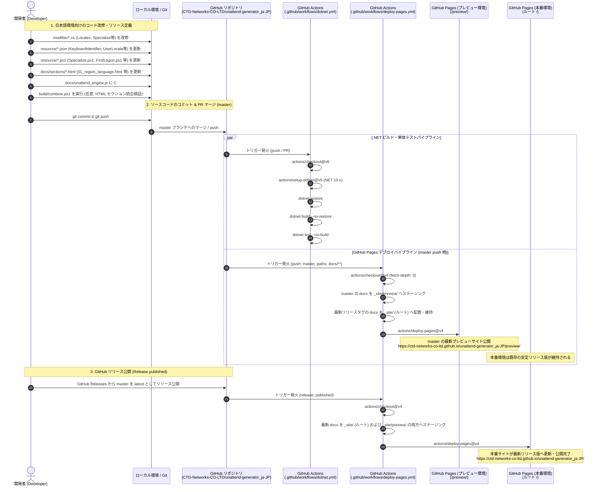
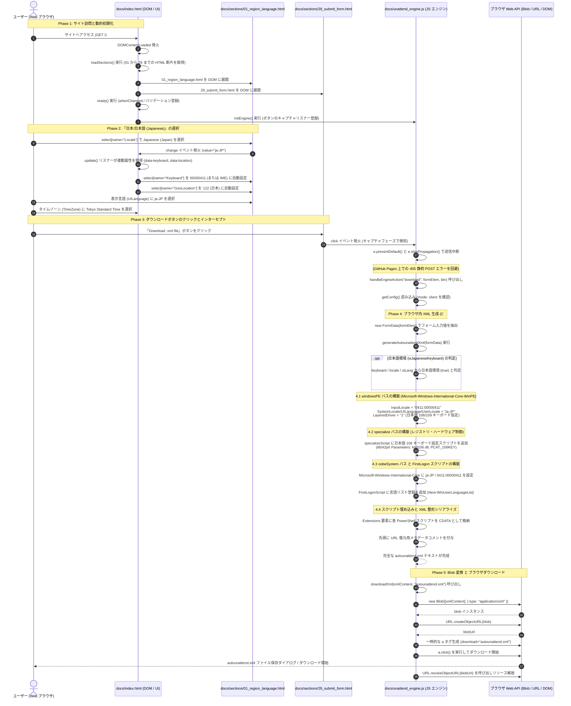

# `unattend-generator_ja-JP`アーキテクチャ＆シーケンス説明

本ドキュメントは、**`CTD-Networks-CO-LTD/unattend-generator_ja-JP`** における Web サイト生成（CI/CD ビルド・デプロイ）および、同サイト上での「日本/日本語 (Japanese)」環境をシミュレートした `autounattend.xml` 生成・ダウンロードまでの一連の動作を、Mermaid シーケンス図および詳細なコード解説により図説・文書化したものです。

---

## 目次

- [`unattend-generator_ja-JP`アーキテクチャ＆シーケンス説明](#unattend-generator_ja-jpアーキテクチャシーケンス説明)
  - [目次](#目次)
  - [1. 全体概要とリポジトリ構成](#1-全体概要とリポジトリ構成)
  - [2. シーケンス図 1: サイト生成・GitHub Actions デプロイフロー](#2-シーケンス図-1-サイト生成github-actions-デプロイフロー)
    - [2.1 Mermaid シーケンス図](#21-mermaid-シーケンス図)
    - [2.2 詳細解説（ソースコード・リソースと CI/CD の連携）](#22-詳細解説ソースコードリソースと-cicd-の連携)
      - [1. 資材・コードベースの役割分担一覧](#1-資材コードベースの役割分担一覧)
      - [2. GitHub Actions CI/CD パイプラインの連携](#2-github-actions-cicd-パイプラインの連携)
  - [3. シーケンス図 2: 「日本/日本語」設定から autounattend.xml をダウンロードするまでの動作](#3-シーケンス図-2-日本日本語設定から-autounattendxml-をダウンロードするまでの動作)
    - [3.1 Mermaid シーケンス図](#31-mermaid-シーケンス図)
    - [3.2 詳細解説（ステップごとのコード呼び出しと日本語固有パラメータ）](#32-詳細解説ステップごとのコード呼び出しと日本語固有パラメータ)
      - [Phase 1: サイト訪問と動的初期化](#phase-1-サイト訪問と動的初期化)
      - [Phase 2: 言語とキーボードの選択（日本/日本語シミュレート）](#phase-2-言語とキーボードの選択日本日本語シミュレート)
      - [Phase 3: ダウンロードボタンのクリックとインターセプト](#phase-3-ダウンロードボタンのクリックとインターセプト)
      - [Phase 4: ブラウザ内 XML 生成ロジック（`generateAutounattendXml`）](#phase-4-ブラウザ内-xml-生成ロジックgenerateautounattendxml)
      - [Phase 5: Blob 変換 \& ブラウザダウンロード処理](#phase-5-blob-変換--ブラウザダウンロード処理)
  - [4. C# 実装とクライアント JavaScript（unattend\_engine.js）の対応関係](#4-c-実装とクライアント-javascriptunattend_enginejsの対応関係)

---

## 1. 全体概要とリポジトリ構成

- **Webサイト公開 URL**:
  - **本番環境（最新リリース版）**: `https://ctd-networks-co-ltd.github.io/unattend-generator_ja-JP/`
  - **プレビュー環境（master最新ビルド版）**: `https://ctd-networks-co-ltd.github.io/unattend-generator_ja-JP/preview/`
- **GitHub リポジトリ**: `https://github.com/CTD-Networks-CO-LTD/unattend-generator_ja-JP`
- **アーキテクチャの要点**:
  - 本リポジトリは、Windows 無人応答ファイル（`autounattend.xml`）生成ツール（元リポジトリ: `cschneegans/unattend-generator`）をフォークし、**日本語キーボード（106/109 キー配列、`kbd106.dll`、`PCAT_106KEY`）や IME、日本のロケール・タイムゾーンに最適化した日本語特化版**です。
  - GitHub Pages という静的 Web ホスティング環境で動作させるため、本来 C# (.NET) サーバー側で行っていた XML 生成エンジン（Modifier クラス群や埋め込みリソース）のロジックが、**完全なクライアントサイド JavaScript（`docs/unattend_engine.js`）として再現・移植**されています。
  - ユーザーのブラウザ上で全ての XML 構築・Blob 生成が行われるため、外部 API サーバーやバックエンドを必要とせず、完全オフライン／クライアント完結で動作します。

---

## 2. シーケンス図 1: サイト生成・GitHub Actions デプロイフロー

C# ソースコード（`modifier/*.cs`）やリソースファイル群（`resource/*.json`, `resource/*.ps1`）、分割 HTML テンプレート群が、GitHub Actions を経て GitHub Pages サイトとして公開されるまでのフローです。

### 2.1 Mermaid シーケンス図

### 2.2 詳細解説（ソースコード・リソースと CI/CD の連携）

#### 1. 資材・コードベースの役割分担一覧

本リポジトリを構成する主要なファイル群と、それぞれの実行環境、役割、日本語化および GitHub Pages 静的ホスティングに伴う対応内容の一覧です。

| 資材 / ファイルパス | 種別 / 実行環境 | 主な役割・機能 | 日本語化・静的化対応の内容 |
| :--- | :--- | :--- | :--- |
| **`modifier/*.cs`** *(オリジナル由来 / Fork改修)* | C# ソースコード (.NET 10 Core) | Windows セットアップ構成パス（`windowsPE`, `specialize`, `oobeSystem`）ごとに `autounattend.xml` の XML DOM を生成・操作するバックエンド実装群 | `LocalesModifier.cs` や `SpecializeModifier.cs` 等において、日本語環境（106/109 キーボード、`kbd106.dll`、`PCAT_106KEY`、`ja-JP`）の要素挿入やレジストリ制御スクリプトの追加ロジックを実装 |
| **`resource/*.json`** *(オリジナル由来 / Fork改修)* | 定義データ (アセンブリ埋め込み JSON) | キーボード配列、ロケール、GeoLocation、UI 表示言語、タイムゾーン、削除対象ブロートウェア等のマスター定義データ | `KeyboardIdentifier.json`（日本語キーボード `00000411` や IME 定義）、`UserLocale.json`（LCID `0411`、日本 GeoLocation `122`、`ja-JP`）等の定義を追加・最適化 |
| **`resource/*.ps1`** *(オリジナル由来 / Fork改修)* | PowerShell テンプレート (インストール時実行スクリプト) | Windows インストール中および初回ログイン時に実行される PowerShell スクリプト（スクリプト展開、specialize 時のハードウェア制御、初回ログオン時の環境初期化） | `Specialize.ps1` や `FirstLogon.ps1` に 106/109 キーボード強制レジストリ（`i8042prt` の `LayerDriver JPN`, `OverrideKeyboardIdentifier`）や言語リスト（`New-WinUserLanguageList`）登録処理を追加 |
| **`docs/sections/*.html`** *(Fork独自 / 分割モジュール化)* | 分割 HTML テンプレート (フロントエンド UI 断片) | 01（地域・言語設定）から 29（送信・ダウンロード）までの 29 個のフォーム入力セクションをモジュール単位で分割管理 | `01_region_language.html` 等で、デフォルト選択肢や属性値に日本語ロケール（`ja-JP`、`00000411`、`122`、`Tokyo Standard Time`）を設定 |
| **`docs/index.html`** *(オリジナル由来 / Fork改修)* | メイン Web ページ (フロントエンド UI / 制御) | サイトのエントリポイント。`sections/*.html` を動的に非同期 fetch して 1 つのフォームを合成し、言語選択とキーボード/地域の連動イベント（`whenChanged`, `update`）を制御 | `unattend_engine.js` のロード、初期値設定、言語ドロップダウン選択時にキーボードと地域を連動変更するバインディング処理（`data-keyboard`, `data-location`）を実装 |
| **`docs/unattend_engine.js`** *(Fork独自 / 新規実装)* | JavaScript エンジン (ブラウザ実行スクリプト) | C# の `Modifier` ロジックおよび `resource/` 内の全スクリプト・定義データを JavaScript に完全移植した、フロントエンド専用の XML 生成エンジン | GitHub Pages の静的配信環境（POST 受信不可）で発生する `405 Method Not Allowed` を防止。ボタンクリックをインターセプトし、ブラウザ内で `Blob` を用いて直接 `autounattend.xml` を組み立て即座にダウンロード |
| **`build/combine.ps1`** *(Fork独自 / 新規作成)* | PowerShell ユーティリティ (ビルド補助) | 分割された `docs/sections/*.html` を単一の静的 HTML ファイルに結合・事前検証するためのスクリプト | 静的サイト配信時のローカル事前検証や、オフライン配布用単一 HTML バンドル生成に利用 |

---

#### 2. GitHub Actions CI/CD パイプラインの連携

リポジトリ内のコード・資材は、GitHub Actions の 2 つのワークフローによって継続的に検証・公開されます。

| ワークフロー定義 | 種別 | トリガー条件 | 実行内容・役割 |
| :--- | :--- | :--- | :--- |
| **`.github/workflows/dotnet.yml`** *(オリジナル由来 / CI)* | CI (継続的インテグレーション) | `main` / `master` への push、Pull Request | **C# Core エンジンの整合性保証**: .NET 10 環境をセットアップし、`resource/*` を DLL に埋め込んで `UnattendGenerator.csproj` をビルド（`dotnet build`）。単体テスト（`dotnet test`）を実行し、コア生成ロジックの品質を担保 |
| **`.github/workflows/deploy-pages.yml`** *(Fork独自 / CD)* | CD (継続的デプロイ) | `docs/**` パスの変更 push、GitHub リリース公開 (`release: published`)、手動実行 (`workflow_dispatch`) | **GitHub Pages プレビュー／本番環境への自動配信**: - **master マージ時**: 最新の `docs/` を `/preview/` へ配置しプレビュー環境を更新。本番ルート（`/`）には Git 上の最新リリースタグの `docs/` を抽出・配置して安定版を維持。 - **リリース公開時**: master ブランチの最新 `docs/` を本番ルート（`/`）および `/preview/` の両方へ本番公開反映。 `actions/upload-pages-artifact@v3` で `_site/` をパッケージ化し、`actions/deploy-pages@v4` でデプロイ |

---

## 3. シーケンス図 2: 「日本/日本語」設定から autounattend.xml をダウンロードするまでの動作

ユーザーがブラウザでサイトにアクセスし、言語とキーボードに「日本/日本語」(Japanese) を選択して `autounattend.xml` をダウンロードするまでのブラウザ内部・コード呼び出しフローです。

### 3.1 Mermaid シーケンス図

### 3.2 詳細解説（ステップごとのコード呼び出しと日本語固有パラメータ）

#### Phase 1: サイト訪問と動的初期化
- **対象ファイル / パス**:
  - `docs/index.html`
  - `docs/sections/01_region_language.html` 〜 `docs/sections/29_submit_form.html`
  - `docs/unattend_engine.js`
- **処理内容**:
  1. **セクションの動的結合**:
     `docs/index.html` の読み込み完了時、`DOMContentLoaded` リスナーから `loadSections()` が実行され、`docs/sections/01_region_language.html` から `29_submit_form.html` までの全 29 個の HTML 断片を非同期 fetch して DOM 上に結合展開します。その後 `ready()` でフォーム連動やバリデーション等のイベントリスナーを登録します。
  2. **エンジンのキャプチャリスナー登録**:
     `docs/unattend_engine.js` の `initEngine()` が実行され、フォーム内の送信ボタン（ダウンロード／プレビュー／ISO 等）のクリックを捕捉するキャプチャリスナーが登録されます。

#### Phase 2: 言語とキーボードの選択（日本/日本語シミュレート）
- **対象ファイル / パス**:
  - `docs/sections/01_region_language.html`
  - `docs/index.html`
- **処理内容**:
  1. **HTML 属性の取得**:
     ユーザーが `docs/sections/01_region_language.html` の言語ドロップダウン（`select[name="Locale"]`）で「Japanese (Japan)」を選択すると、`option[value="ja-JP"]` に定義された属性（`data-keyboard="00000411"`, `data-location="122"`）が参照されます。
  2. **連動反映**:
     `docs/index.html` の `whenChanged` リスナー（`update` 関数）が連動属性を取得し、キーボード選択（`select[name="Keyboard"]`）を日本語キーボード `00000411`（または IME）へ、地理的位置（`select[name="GeoLocation"]`）を日本 `122` へ自動更新します。あわせて表示言語（`UILanguage`）に `ja-JP`、タイムゾーン（`TimeZone`）に `Tokyo Standard Time` が設定されます。

#### Phase 3: ダウンロードボタンのクリックとインターセプト
- **対象ファイル / パス**:
  - `docs/sections/29_submit_form.html`
  - `docs/unattend_engine.js`
- **処理内容**:
  1. **静的ホスティング保護（イベントのインターセプト）**:
     ユーザーが `docs/sections/29_submit_form.html` の「Download .xml file」ボタン（`button[formaction="./download/"]`）をクリックすると、`docs/unattend_engine.js` のクリックリスナーがキャプチャフェーズでイベントを捕捉します。
  2. **405 エラーの防止と処理ルーティング**:
     GitHub Pages（静的配信）での POST 受信による `405 Method Not Allowed` を防ぐため、`e.preventDefault()` および `e.stopPropagation()` で送信を中断し、同ファイル内の `handleEngineAction('download', form, btn)` を呼び出してクライアント内での XML 生成処理に移行します。

#### Phase 4: ブラウザ内 XML 生成ロジック（`generateAutounattendXml`）
- **対象ファイル / パス**:
  - `docs/unattend_engine.js`
- **処理内容**:
  1. **日本語環境フラグの判定**:
     `new FormData(formElem)` で取得したパラメータ（`Keyboard`, `Locale`, `UILanguage`）を評価し、日本語環境（`isJapaneseKeyboard`）を `true` と判定します。
  2. **`windowsPE` パス構築**:
     `Microsoft-Windows-International-Core-WinPE` コンポーネントを生成し、`InputLocale`（`0411:00000411`）、`SystemLocale` / `UILanguage` / `UserLocale`（`ja-JP`）、および日本語 106/109 キーボード指定の `LayeredDriver`（`1`）を設定します。
  3. **`specialize` パス構築（ハードウェア・レジストリ制御）**:
     インストール後に PS/2・USB キーボードが英語配列（101/104）へフォールバックするのを防止するため、`specializeScript` にレジストリ設定スクリプト（`HKLM:\SYSTEM\CurrentControlSet\Services\i8042prt\Parameters` に対する `kbd106.dll`, `PCAT_106KEY`, サブタイプ `2`, タイプ `7`）を注入します。
  4. **`oobeSystem` パス & `FirstLogon` スクリプト構築**:
     `Microsoft-Windows-International-Core` コンポーネントに `ja-JP` を設定し、`firstLogonScript` に言語リスト登録（`New-WinUserLanguageList -Language 'ja-JP'`）およびシステム設定コピー処理（`Copy-UserInternationalSettingsToSystem`）を追加します。
  5. **スクリプト埋め込みと XML 整形シリアライズ**:
     各 PowerShell スクリプトを `<Extensions>` 要素内の CDATA セクションとして格納し、先頭に Web フォーム復元用の URL クエリ文字列コメントを付与した完全な `autounattend.xml` 文字列を生成します。

#### Phase 5: Blob 変換 & ブラウザダウンロード処理
- **対象ファイル / パス**:
  - `docs/unattend_engine.js`
  - ブラウザ Web API（`Blob`, `URL`, `HTMLAnchorElement`）
- **処理内容**:
  1. **Blob インスタンスの生成**:
     `docs/unattend_engine.js` の `downloadXml(xmlContent, filename)` が呼び出され、メモリ上の XML 文字列から UTF-8 Blob（`application/xml;charset=utf-8`）を生成します。
  2. **オブジェクト URL の発行とダウンロード発火**:
     `URL.createObjectURL(blob)` で一時的なオブジェクト URL を作成し、動的に生成した `<a>` タグ（`download="autounattend.xml"`）の `click()` を実行して、ブラウザ標準のファイル保存ダイアログ／ダウンロードを開始させます。
  3. **メモリリソースの解放**:
     ダウンロード完了後、`URL.revokeObjectURL(blobUrl)` を実行してメモリリソースを適切に解放します。

---

## 4. C# 実装とクライアント JavaScript（unattend_engine.js）の対応関係

本リポジトリでは、C# のバックエンド処理がクライアントサイド JavaScript へ 1 対 1 で忠実に移植されています。

| 処理フェーズ・機能 | C# 実装クラス / ファイル (`modifier/`, `resource/`) | JavaScript 実装関数 (`docs/unattend_engine.js`) |
| :--- | :--- | :--- |
| **ロケール・言語設定** | `LocalesModifier.cs`, `resource/UserLocale.json` | `generateAutounattendXml` 内の `isJapaneseKeyboard` 判定および `peCore` / `oobeCore` 構築 |
| **日本語キーボードレジストリ** | `SpecializeModifier.cs` | `specializeScript.append([... 'kbd106.dll', 'PCAT_106KEY' ...])` |
| **初回ログオンスクリプト** | `FirstLogonModifier.cs`, `resource/FirstLogon.ps1` | `firstLogonScript.append([... 'New-WinUserLanguageList' ...])` |
| **WindowsPE 初期構成** | `WindowsPeModifier.cs` | `settingsPasses['windowsPE']` の各エレメント生成 (`LayeredDriver: 1`) |
| **アカウント・パスワード設定** | `UserAccountsModifier.cs` | `UserAccounts`, `LocalAccounts`, `AutoLogon` の要素追加 |
| **スクリプト埋め込み** | `ExtractScripts.ps1`, `ExtensionsModifier.cs` | `<Extensions xmlns="https://schneegans.de/windows/unattend/layout">` の生成 |
| **設定値シリアライズ** | `UnattendGenerator.cs` | `serializeXmlToString(xmlDoc)` + URL クエリ復元コメント付与 |

---
*Document generated for CTD-Networks-CO-LTD/unattend-generator_ja-JP.*

